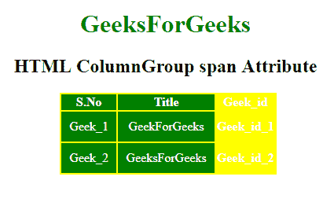

# HTML | colgroup 跨度属性

> 原文:[https://www.geeksforgeeks.org/html-colgroup-span-attribute/](https://www.geeksforgeeks.org/html-colgroup-span-attribute/)

**HTML < colgroup > span 属性**用于定义 **< colgroup >** 元素应该跨越的列数。

**语法:**

```html
<colgroup span="number">
```

**属性值:**

*   **数字:**它包含指定 col 元素应该跨越的数量的数值。

**示例:**

```html
<!DOCTYPE html>
<html>

<head>
    <title>
        HTML ColumnGroup span Attribute
    </title>

    <style>
        #myColGroup {
            background: green;
        }

        table {
            color: white;
            margin-left: 180px;
            background: yellow;
        }

        #Geek_p {
            color: green;
            font-size: 30px;
        }

        td {
            padding: 10px;
        }
    </style>
</head>

<body style="text-align:center;">

    <h1 style="color:green;"> 
            GeeksForGeeks 
        </h1>

    <h2>
      HTML ColumnGroup span Attribute
  </h2>

    <table>
        <colgroup id="myColGroup" span="2">
      </colgroup>
        <tr>
            <th>S.No</th>
            <th>Title</th>
            <th>Geek_id</th>
        </tr>
        <tr>
            <td>Geek_1</td>
            <td>GeekForGeeks</td>
            <th>Geek_id_1</th>
        </tr>
        <tr>
            <td>Geek_2</td>
            <td>GeeksForGeeks</td>
            <th>Geek_id_2</th>
        </tr>
    </table>
</body>

</html>
```

**输出:**


**支持的浏览器:**支持的浏览器 **HTML < colgroup > span 属性**如下:

*   谷歌 Chrome
*   微软公司出品的 web 浏览器
*   火狐浏览器
*   苹果 Safari
*   歌剧