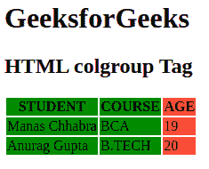

# HTML colgroup 标签

> 原文:[https://www.geeksforgeeks.org/html-colgroup-tag/](https://www.geeksforgeeks.org/html-colgroup-tag/)

此标记用于指定表格中一列或多列的组以进行格式化。对于将样式应用于整个列，而不是对每列和每行重复样式，这很有用。使用<列组>标签中的 [<列>](https://www.geeksforgeeks.org/html-col-tag/) 标签为<列组>中的列定义不同的属性。HTML 4.01 < colgroup >中的大部分属性在 HTML5 中是不支持的。

**语法:**

```html
<colgroup> Column lists... </colgroup>
```

**属性:**

*   [**对齐:**](https://www.geeksforgeeks.org/html-align-attribute/) 用于对齐一组列中的文本或内容。对齐属性的值为左、右、居中、两端对齐、字符。
*   [**char**](https://www.geeksforgeeks.org/html-col-char-attribute/) **:** 用于对齐列组中的字符，这些属性的值就是字符。
*   [](https://www.geeksforgeeks.org/html-tr-charoff-attribute/)****:**用于设置从字符属性指定的字符开始对齐的字符数。这些属性的值是数字形式的。**
*   **[**span**](https://www.geeksforgeeks.org/span-tag-html/) **:** 用于指定有列组标签的列数。这些值是数字形式的。**
*   **[](https://www.geeksforgeeks.org/html-td-valign-attribute/)****:**它指定一个列组中内容的垂直对齐。它的值是顶、中、底、基线。****
*   ****[**宽度**](https://www.geeksforgeeks.org/html-table-width-attribute/) **:** 它定义了一个列组的宽度。它的值是像素，%，相对长度。**** 

******示例:**下面的示例解释了 HTML colgroup 标记。**** 

## ****超文本标记语言****

```html
**<!DOCTYPE html>
<html>
  <body>
    <h1>GeeksforGeeks</h1>
    <h2>HTML colgroup tag</h2>
    <table>
      <!-- colgroup tag starts here-->
      <colgroup>
        <col span="2" style="background-color: green; color: white" />
        <col style="background-color: tomato" />
            <!-- colgroup tag ends here--> 
      </colgroup>
      <tr>
        <th>STUDENT</th>
        <th>COURSE</th>
        <th>AGE</th>
      </tr>
      <tr>
        <td>Manas Chhabra</td>
        <td>BCA</td>
        <td>19</td>
      </tr>
      <tr>
        <td>Anurag Gupta</td>
        <td>B.TECH</td>
        <td>23</td>
      </tr>
    </table>
  </body>
</html>**
```

******输出:****** 

********

******支持的浏览器:******

*   ****谷歌 Chrome****
*   ****微软公司出品的 web 浏览器****
*   ****火狐浏览器****
*   ****歌剧****
*   ****旅行队****