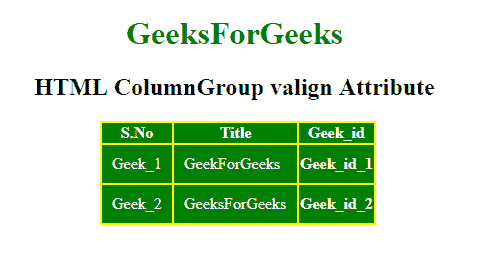

# HTML | colgroup valign 属性

> 原文:[https://www . geesforgeks . org/html-col group-valign-attribute/](https://www.geeksforgeeks.org/html-colgroup-valign-attribute/)

**HTML <列组>标签属性**用于指定列组元素中文本内容的垂直对齐方式。

**语法:**

```html
<colgroup valign="top | middle | bottom | baseline">
```

**属性值**

*   **顶部:**将内容设置为顶部对齐。
*   **中:**将内容设置为中对齐。
*   **底部:**将内容设置为底部对齐。
*   **基线:**设置内容为基线。基线是大多数角色所处的位置。

**示例:**

```html
<!DOCTYPE html>
<html>

<head>
    <title>
        HTML ColumnGroup valign Attribute
    </title>

    <style>
        #myColGroup {
            background: green;
        }

        table {
            color: white;
            margin-left: 180px;
            background: yellow;
        }

        #Geek_p {
            color: green;
            font-size: 30px;
        }

        td {
            padding: 10px;
        }

        h1,
        h2 {
            text-align: center;
        }
    </style>
</head>

<body>

    <h1 style="color:green;"> 
        GeeksForGeeks 
    </h1>

    <h2> 
        HTML ColumnGroup valign Attribute 
    </h2>

    <table>
        <colgroup id="myColGroup" 
                  span="3" 
                  align="char"
                  char="." 
                  charoff="3" 
                  valign="top">
        </colgroup>

        <tr>
            <th>S.No</th>
            <th>Title</th>
            <th>Geek_id</th>
        </tr>
        <tr>
            <td>Geek_1</td>
            <td>GeekForGeeks</td>
            <th>Geek_id_1</th>
        </tr>
        <tr>
            <td>Geek_2</td>
            <td>GeeksForGeeks</td>
            <th>Geek_id_2</th>
        </tr>
    </table>
</body>

</html>
```

**输出:**


**支持的浏览器:**支持的浏览器**HTML<colgroup>valign**属性如下:

*   微软公司出品的 web 浏览器