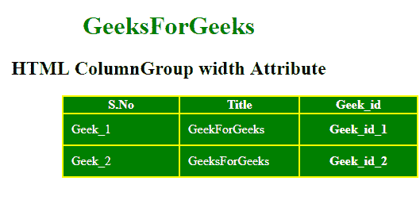

# HTML | colgroup 宽度属性

> 原文:[https://www . geesforgeks . org/html-col group-width-attribute/](https://www.geeksforgeeks.org/html-colgroup-width-attribute/)

**HTML < colgroup >宽度属性**用于指定 colgroup 元素的宽度。<柱组>属性设置柱组的预定义宽度。

**语法:**

```html
<colgroup width="pixels|%|relative_lngth">
```

**属性值:**

*   **像素:**以像素为单位指定列组的宽度。
*   **%:** 它以百分比的形式指定 colgroup 元素的宽度。对于 ex-width =“50%”
*   **relative_length:** 它以像素为单位划分表格的长度。

**示例:**

```html
<!DOCTYPE html> 
<html> 

<head> 
    <title> 
        HTML ColumnGroup width Attribute 
    </title> 

    <style> 
        #myColGroup { 
            background: green; 
        } 

        table { 
            color: white; 
            background: yellow; 
        } 

        #Geek_p { 
            color: green; 
            font-size: 30px; 
        } 

        td { 
            padding: 10px; 
        } 
    </style> 
</head> 

<body> 
    <center>
        <h1 style="color:green;"> 
            GeeksForGeeks 
        </h1> 

        <h2>HTML ColumnGroup width Attribute</h2> 

        <table> 
            <colgroup id="myColGroup" span="3"
                    align = "left" width="150"> 
            </colgroup> 
            <tr> 
                <th>S.No</th> 
                <th>Title</th> 
                <th>Geek_id</th> 
            </tr> 
            <tr> 
                <td>Geek_1</td> 
                <td>GeekForGeeks</td> 
                <th>Geek_id_1</th> 
            </tr> 
            <tr> 
                <td>Geek_2</td> 
                <td>GeeksForGeeks</td> 
                <th>Geek_id_2</th> 
            </tr> 
        </table> 
    </center>
</body> 

</html>
```

**输出:**


**支持的浏览器:**支持的浏览器< colgroup >宽度属性如下:

*   谷歌 Chrome
*   微软公司出品的 web 浏览器
*   火狐浏览器
*   旅行队
*   歌剧