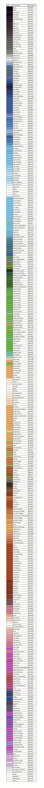

# HTML 颜色名称

> 原文:[https://www.geeksforgeeks.org/html-color-names/](https://www.geeksforgeeks.org/html-color-names/)

HTML 颜色链接到它们各自的颜色代码。它们充当在网络上表示各种颜色的标识符。这些代码可以是关键字名称、十六进制值、RGB(红、绿、蓝)三元组或 HSL(色相、饱和度、明度)三元组。有 16，777，216 种颜色可供选择。

**例如:**

蓝色可以表示如下:

*   蓝色(关键字名称)
*   #0000ff (HEX)
*   (0，0，255) (RGB)
*   (0，100%，50%) (HSL)

一种称为颜色选择器的工具允许用户通过单击可视颜色范围来选择颜色，以定位特定的代码。调色板提供了常用颜色的列表，以便快速选择。

由颜色样本、颜色名称和十六进制值组成的 HTML 调色板:

