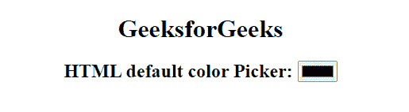
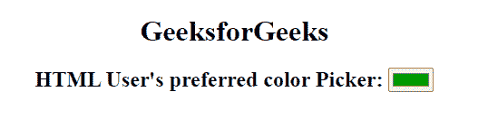

# HTML 颜色选择器

> 原文:[https://www.geeksforgeeks.org/html-color-picker/](https://www.geeksforgeeks.org/html-color-picker/)

在本文中，我们将了解 HTML 颜色选择器&将通过示例了解它的实现。HTML 中的 type color[<输入>](https://www.geeksforgeeks.org/html-input-tag/) 元素为用户提供了一个界面，用户可以从默认的拾色器中选择一种颜色进行交互，或者通过在 RGB 字段中给出所需的值来设计自己的颜色。

**语法:**

```html
<input type="color" value="#228c4e">
```

*   [**类型**](https://www.geeksforgeeks.org/html-input-type-attribute/) **:** 指定要显示的<输入>元素的类型。默认值为文本。
*   [**值**](https://www.geeksforgeeks.org/html-input-value-attribute/) **:** 它指定使用它的元素的值或用于指定输入元素的初始值。

**进场:**

*   在 [<体内申报<input>标记>标记](https://www.geeksforgeeks.org/html-body-tag/)标记。
*   使用*类型的*属性和<输入的>元素。
*   将*类型*属性定义为值“颜色”。

**示例 1:** 在本例中，我们将放置默认的颜色选择器。

## 超文本标记语言

```html
<!DOCTYPE html>
<html>

<body style="text-align: center;">
    <h1>
        GeeksforGeeks
    </h1>
    <h2>
        HTML default color Picker:

        <!-- The default color picker color is black-->
        <input type="color">
    </h2> 
</body>

</html>
```

**输出:**拾色器的**默认**值为 **#000000(黑色)。**用户可以在 value 属性的帮助下指定自己的拾色器色调。



**示例 2:** 在本例中，我们将使用 value 属性将默认颜色设置为绿色。

## 超文本标记语言

```html
<!DOCTYPE html>
<html>

<body style="text-align: center;">
    <h1>
        GeeksforGeeks
    </h1>
    <h2>
        HTML User's preferred color Picker:

        <!-- Here we set a fixed color by value attribute-->
        <input type="color" value="#009900">
    </h2> 
</body>

</html>
```

**输出:**文本在 **RGB** 字段中的值可以根据方便随时更改，并且会生成新的颜色。



**支持的浏览器:**

*   谷歌 Chrome 20.0
*   微软边缘 14.0
*   Firefox 29.0
*   Opera 12.0
*   Safari 12.1