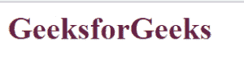
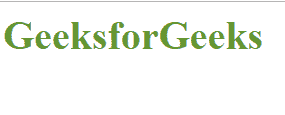
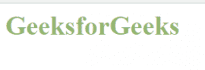
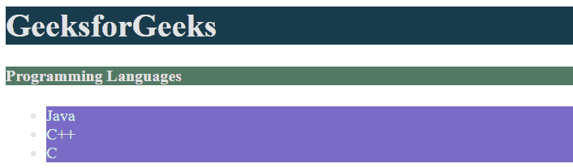

# HTML |颜色样式和 HSL

> 原文:[https://www.geeksforgeeks.org/html-color-styles-hsl/](https://www.geeksforgeeks.org/html-color-styles-hsl/)

颜色被用来使页面更有吸引力。这里有不同的风格，可以通过不同颜色的组合来创造新的颜色。

1.  **十六进制样式:**在这个样式中，我们用 6 位十六进制数(从 0 到 F)定义颜色。它用“#”表示。前两位数字表示红色，后两位表示绿色，最后两位表示蓝色。
    **示例**:如果我们想要紫色的所有‘h1’标签。

```html
h1{
 color:#00FF00;
}
```



2.  **RGB 风格【红绿蓝】:**在这种情况下，我们需要给出 3 个数字，分别表示混合颜色中所需的红色、绿色和蓝色的数量。每种颜色的范围从 0 到 255。
    **示例**:如果我们想要所有的‘h1’标签都是绿色的。

```html
h1{
      color:rgb(0, 255, 0);
}
```



1.  **注** : rgba(0，0，0)为黑色，rgb(255，255，255)为白色。

2.  **RGBA 风格【红绿蓝阿尔法】:**这种风格让我们可以按照自己的意愿让颜色变得透明。Alpha 表示透明度。绿色、蓝色和红色的范围从 0 到 255，α的范围从 0 到 1。
    **示例**:如果我们想要所有的‘h1’标签都是绿色的。

```html
h1{
  color:rgba(11, 99, 150, 1);
 }
```



2.  **HSL 颜色:**这里‘H’代表色相，‘S’代表饱和度，‘L’代表明度。HSL 颜色值指定为:
    **语法** :

```html
hsl(hue, saturation, lightness)
```

## 超文本标记语言

```html
<!-- Write HTML code here -->
<head>
    <title>GeeksforGeeks</title>
    <style type="text/css">
        h1{
            color:#0FFFF0;
            background-color: hsl(200, 50%, 20%);
            color: hsl(200, 20%, 90%);

        }
        h4{
            color:rgb(0, 255, 0);
            background-color: hsl(150, 20%, 40%);
            color: hsl(360, 30%, 90%);
        }
        li{
            color:rgba(11, 99, 150, 1);
            background-color: hsl(250, 45%, 60%);
            color: hsl(175, 35%, 87%);
        }
    </style>
</head>
<body>
    <h1>GeeksforGeeks</h1>
    <h4>Programming Languages</h4>
    <ul>
        <li>Java</li>
        <li>C++</li>
        <li>C</li>
    </ul>
</body>
</html>
```



**支持的浏览器:**

*   谷歌 Chrome
*   微软边缘
*   火狐浏览器
*   歌剧
*   旅行队