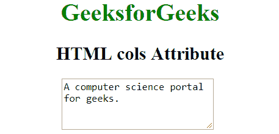

# HTML | cols 属性

> 原文:[https://www.geeksforgeeks.org/html-cols-attribute/](https://www.geeksforgeeks.org/html-cols-attribute/)

HTML 中的 cols 属性用于告诉浏览器一行应该容纳多少平均宽度的字符，即要显示的列数。
**注意:**此属性仅适用于 [<文本区>](https://www.geeksforgeeks.org/html-textarea-cols-attribute/?ref=rp) 。
**语法:**

```html
<textarea cols = "value">Text content...</textarea>
```

**属性值:**默认值为 20。它包含一个代表 textarea 元素宽度的数值。

**例:**

## 超文本标记语言

```html
<!DOCTYPE html>
<html>

<head>
    <title>HTML cols Attribute</title>
    <style>
        h1,
        h2 {
            text-align: center;
        }
    </style>
</head>

<body>
    <center>
        <h1 style="color: green;">
            GeeksforGeeks
        </h1>

        <h2>
            HTML cols Attribute
        </h2>

        <!-- Below textarea is assigned a cols value 25
            That is, 25 characters will fit in a line -->
        <textarea rows="4" cols="25">
            A computer science portal for geeks.
        </textarea>
    </center>
</body>

</html>   
```

**输出:**



**支持的浏览器:**cols 属性支持的浏览器如下:

*   谷歌 Chrome
*   微软公司出品的 web 浏览器
*   火狐浏览器
*   歌剧
*   苹果 Safari