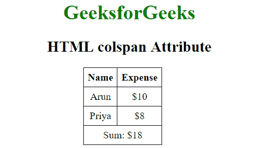
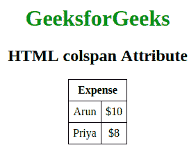

# HTML | colspan 属性

> 原文:[https://www.geeksforgeeks.org/html-colspan-attribute/](https://www.geeksforgeeks.org/html-colspan-attribute/)

HTML 中的 colspan 属性指定单元格应该跨越的列数。它允许单个表格单元格跨越多个单元格或列的宽度。它提供了与 Excel 等电子表格程序中的“合并单元格”相同的功能。
**用法:**在创建 [HTML 表格](https://www.geeksforgeeks.org/html-tables/)时，可以与[<【TD】>](https://www.geeksforgeeks.org/html-tdcolspan-attribute/?ref=rp)和 [< th >](https://www.geeksforgeeks.org/html-th-colspan-attribute/?ref=rp) 元素一起使用。

**属性值:**它包含一个值，即**数**，该值指定一个单元格应该跨越的列数。

*   **<【TD】>:**col span 属性与< td >标签一起使用时，决定了它应该跨越的标准单元格的数量。
    **语法:**

```html
<td colspan = "value">table content...</td>
```

**值**指定单元格填充的列数。该值必须是整数。
**例:**

## 超文本标记语言

```html
<!DOCTYPE html>
<html>

<head>
    <title>HTML colspan Attribute</title>
    <style>

        table, th, td {
            border: 1px solid black;
            border-collapse: collapse;
            padding: 6px;
            text-align:center;
        }

    </style>
</head>

<body>
    <center>
        <h1 style="color: green;">GeeksforGeeks</h1>
        <h2>HTML colspan Attribute</h2>
        <table>
            <tr>
                <th>Name</th>
                <th>Expense</th>
            </tr>
            <tr>
                <td>Arun</td>
                <td>$10</td>
            </tr>
            <tr>
                <td>Priya</td>
                <td>$8</td>
            </tr>

            <!-- The last row -->
            <tr>
                <!-- This td will span two columns, that is a
                single column will take up the space of 2 -->
                <td colspan="2">Sum: $18</td>
            </tr>
        </table>
    </center>
</body>

</html>                
```

**输出:**



*   **<th>:**colspan 属性在与< th >标签一起使用时，决定了它应该跨越的标题单元格的数量。
    **语法:**

```html
<th colspan = "value">table content...</th>
```

**值**指定单元格填充的列数。该值必须是整数。
T3】例:

## 超文本标记语言

```html
<!DOCTYPE html>
<html>

<head>
    <title>HTML colspan Attribute</title>
    <style>
        table,
        th,
        td {
            border: 1px solid black;
            border-collapse: collapse;
            padding: 6px;
            text-align: center;
        }
    </style>
</head>

<body>
    <center>
        <h1 style="color: green;">GeeksforGeeks</h1>
        <h2>HTML colspan Attribute</h2>

        <table>
            <tr>
                <th colspan="2">Expense</th>
            </tr>

            <tr>
                <td>Arun</td>
                <td>$10</td>
            </tr>

            <tr>
                <td>Priya</td>
                <td>$8</td>
            </tr>
        </table>
    </center>
</body>

</html>    
```

**输出:**



**支持的浏览器:**由 *colspan* 属性支持的浏览器如下:

*   谷歌 Chrome
*   微软公司出品的 web 浏览器
*   火狐浏览器
*   歌剧
*   旅行队

HTML 是网页的基础，通过构建网站和网络应用程序用于网页开发。您可以通过以下 [HTML 教程](https://www.geeksforgeeks.org/html-tutorials/)和 [HTML 示例](https://www.geeksforgeeks.org/html-examples/)从头开始学习 HTML。