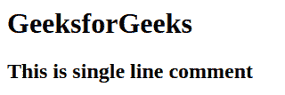
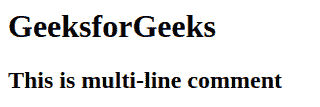
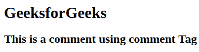

# HTML 评论

> 原文:[https://www.geeksforgeeks.org/html-comments/](https://www.geeksforgeeks.org/html-comments/)

注释标签()用于在 HTML 代码中插入注释。这是一个很好的编码实践，这样编码者和读者可以得到帮助来理解代码。理解复杂的代码很有帮助。注释标签在代码调试期间很有用。

*   它是一段简单的代码，被网络浏览器删除(忽略)，即不被浏览器显示。
*   它帮助编码者和读者理解代码片段，尤其是在复杂的源代码中。

**语法:**

```html
<!-- Comments here -->
```

**HTML 注释的类型:**HTML 中有三种类型的注释，分别是:

*   单行注释
*   多行注释
*   使用<comment>标签</comment>

**单行评论:**

## 超文本标记语言

```html
<!DOCTYPE html>
<html>

<body>
    <!--This is heading Tag -->
    <h1>GeeksforGeeks</h1>

    <!--This is single line comment -->
    <h2>This is single line comment</h2>
</body>

</html>
```

**输出:**这里可以看到单行评论。单行注释不会显示在输出中。



**多行注释:**使用(<)也可以使用多行！––>)。

## 超文本标记语言

```html
<!DOCTYPE html>
<html>
  <body>
    <!-- This is
         heading tag -->
    <h1>GeeksforGeeks</h1>

    <!-- This is
         multi-line
         comment -->
    <h2>This is multi-line comment</h2>
  </body>
</html>
```

**输出:**这里我们可以看到在评论区我们用了多行但是还是没有打印出来。



**使用<评论>标签:**曾经有一个 HTML strong <评论> 标签，但是没有任何现代浏览器支持。

## 超文本标记语言

```html
<!DOCTYPE html>
<html>

<body>
    <comment>This is heading tag</comment>
    <h1>GeeksforGeeks</h1>

    <comment>This is multi-line
             comment
    </comment>
    <h2>This is a comment using</h2>
</body>

</html>
```

**输出:**



**注意:**现代浏览器不支持<注释>标签。