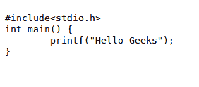

# HTML |计算机代码元素

> 原文:[https://www.geeksforgeeks.org/html-computer-code-elements/](https://www.geeksforgeeks.org/html-computer-code-elements/)

计算机具有独特的格式和文本样式来显示与代码相关的消息。`标签用于显示网站上的电脑代码。有许多元素可以用 HTML 标记计算机代码。
[**<代码>标签**](https://www.geeksforgeeks.org/html-code-tag/)**:**HTML 中的<代码>标签用于定义计算机代码。在创建网页的过程中，有时需要显示计算机编程代码。它可以通过 HTML 的任何基本标题标签来完成，但是 HTML 提供了一个单独的标签，即<代码>标签。
代码标签是代表计算机输出的特定类型的文本。HTML 提供了许多文本格式化的方法，但是<代码>标签是以固定的字母大小、字体和间距显示的。
**语法:**` 

```html
<code> Computer code contents... </code>
```

**例 1:**

## 超文本标记语言

```html
<pre>
<code>
#include<stdio.h>
int main() {
    printf("Hello Geeks");
}
</code>
</pre>
```

**输出:**



**例 2:**

## 超文本标记语言

```html
<pre>
<code>
class GFG 
{ 
    // Program begins with a call to main()
    // Print "Hello, World" to the terminal window 
    public static void main(String args[]) 
    { 
        System.out.println("Hello, World"); 
    } 
} 
</code>
</pre> 
```

**输出:**


**注意:**写在<代码>标签里面的程序和基本的标题标签、段落标签有一些不同的字体大小和字体类型。< pre >标签用于显示代码片段，因为它总是保持文本格式不变。
**关于<代码的几点>标签:**

*   它主要用于将代码片段显示到 web 浏览器中。
*   此标签设置其元素的样式以匹配计算机的默认文本格式。
*   默认情况下，网络浏览器使用单声道空间字体系列来显示`标签元素内容。`

[**<kbd>Tag**](https://www.geeksforgeeks.org/html-kbd-tag/)**:**是短语标签，用于定义键盘输入。< kbd >标签之间的文本代表应该在键盘上键入的类似文本。
**语法:**

```html
<kbd> Contents... </kbd>
```

**例:**

## 超文本标记语言

```html
<!DOCTYPE html>
<html>
    <head>
        <title>The kbd tag</title>
        <style>
            body {
                text-align:center;
            }
        </style>
    </head>
    <body>
        <div class = "gfg">GeeksforGeeks</div>
        <kbd>A computer</kbd>
        <kbd>science</kbd>
        <kbd>portal</kbd>
    </body>
</html>                    
```

**输出:**


**关于< kbd >标签的几点:**T2】

*   由`标签包围的文本通常以浏览器的默认单空格字体显示。`
*   使用 CSS 可以获得更丰富的效果
*   没有标签特定的属性。

[**< pre >标签**](https://www.geeksforgeeks.org/html-pre-tag/)**:**HTML 中的< pre >标签用于定义预格式化文本块，该文本块保留了网页浏览器忽略的文本空格、换行符、制表符和其他格式字符。< pre >元素中的文本以固定宽度字体显示，但可以使用 CSS 进行更改。<前置>标签需要一个开始和结束标签。
**语法:**

```html
<pre> Contents... </pre>
```

**例 1:**

## 超文本标记语言

```html
<!DOCTYPE html>
<html>
    <head>
        <title>pre tag</title>
    </head>
    <body>
        <pre>
            GeeksforGeeks
            A Computer   Science Portal  For Geeks
        </pre>
    </body>
</html>                                      
```

**输出:**


**例 2:**

## 超文本标记语言

```html
<!DOCTYPE html>
<html>
    <head>
        <title>pre tag with CSS</title>
        <style>
            pre {
                font-family: Arial;
                color: #009900;
                margin: 25px;
            }
        </style>
    </head>
    <body>
        <pre>
            GeeksforGeeks
            A Computer  Science Portal  For Geeks
        </pre>
    </body>
</html>
```

**输出:**


[**<samp>Tag**](https://www.geeksforgeeks.org/html-samp-tag/)**:**它是一个短语标签，用于定义计算机程序的输出文本样本。HTML 示例元素用于包含内联文本，该文本表示计算机程序的示例(或引用)输出。
**语法:**

```html
<samp> Contents... </samp>
```

**例:**

## 超文本标记语言

```html
<!DOCTYPE html>
<html>
    <head>
        <title>samp tag</title>
    </head>
    <style>
        body {
            text-align:center;
        }
        .gfg {
            font-size:40px;
            font-weight:bold;
            color:green;
        }
        .geeks {
            font-size:25px;
            font-weight:bold;
        }
    </style>
    <body>
        <div class ="gfg">GeeksForGeeks</div>
        <div class = "geeks"><samp> Tag</div>
        <samp>A computer science portal for Geeks</samp>
    </body>
</html>                    
```

**输出:**


[**<var>Tag**](https://www.geeksforgeeks.org/html-var-tag/)**:**它是一个短语标记，用于指定数学方程或计算机程序中的变量。在大多数浏览器中，该标签的内容以斜体格式显示。
**语法:**

```html
<var> Contents... </var>
```

**例:**

## 超文本标记语言

```html
<!DOCTYPE html>
<html>
    <head>
        <title>var tag</title>
    </head>
    <style>
        body {
            text-align:center;
        }
        .gfg {
            font-size:40px;
            font-weight:bold;
            color:green;
        }
        .geeks {
            font-size:25px;
            font-weight:bold;
        }
    </style>
    <body>
        <div class ="gfg">GeeksForGeeks</div>
        <div class = "geeks"><var> Tag</div>
        <var>GeeksforGeeks Variable</var>
    </body>
</html>                    
```

**输出:**


**支持的浏览器:**

*   谷歌 Chrome
*   微软边缘
*   火狐浏览器
*   歌剧
*   旅行队