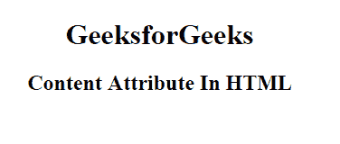

# HTML |内容属性

> 原文:[https://www.geeksforgeeks.org/html-content-attribute/](https://www.geeksforgeeks.org/html-content-attribute/)

**HTML 内容属性**用于给*与 http-equiv 或名称属性*相关的值。内容属性可以与 **<元>** 元素相关联。

**支持的标签:**

*   **< 当 >**

**语法:**

```html
<meta content="text">
```

**属性值:**它包含文本中指定元信息内容的值。
**例:**本例说明了内容属性的使用。

## 超文本标记语言

```html
<!DOCTYPE html>
<html>

<head>
    <title>
      content attribute in HTMLs
  </title>
    <meta name="keywords"
          content="content attribute
                   in Meta Tag, Metadata" />
</head>

<body style="text-align:center;">
    <h1> GeeksforGeeks</h1>
    <h2>Content Attribute In HTML</h2>
</body>

</html>
```

**输出:**



**支持的浏览器:***HTML 内容属性*支持的浏览器如下:

*   谷歌 Chrome
*   微软公司出品的 web 浏览器
*   火狐浏览器
*   歌剧
*   旅行队