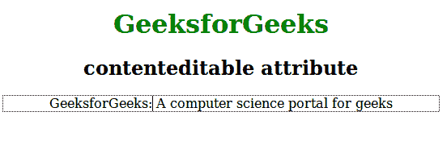

# HTML |内容可编辑属性

> 原文:[https://www . geesforgeks . org/html-content editable-attribute/](https://www.geeksforgeeks.org/html-contenteditable-attribute/)

它用于指定元素中存在的内容是否可编辑。当元素中未设置此属性时，此元素将从其父元素继承。
**支持的标签:**支持所有 HTML 元素。

**语法:**

```html
<element contenteditable = "true|false">
```

**属性:**主要是一个全局属性的实例，可以用在任何 HTML 元素中。该属性包含真或假两个值。如果属性值为真，则内容可编辑，如果属性值为假，则内容不可编辑。
**例:**

## 超文本标记语言

```html
<!DOCTYPE html>
<html>
    <head>
        <title>contenteditable attribute</title>
        <style>
            body {
                width:60%;
                text-align:center;
            }
            h1 {
                color:green;
            }
        </style>
    </head>
    <body>
        <h1>GeeksforGeeks</h1>
        <h2>contenteditable attribute</h2>
        <p contenteditable="true">GeeksforGeeks:
         A computer science portal for geeks</p>

    </body>
</html>                   
```

**输出:**



**支持的浏览器:**支持的浏览器*内容可编辑*属性如下:

*   谷歌 Chrome 4.0
*   Internet Explorer 6.0
*   Firefox 3.5
*   歌剧 10.1
*   Safari 3.1