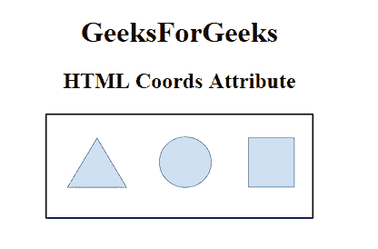
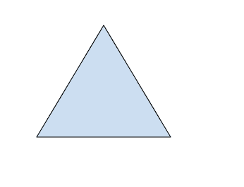

# HTML |坐标属性

> 原文:[https://www.geeksforgeeks.org/html-coords-attribute/](https://www.geeksforgeeks.org/html-coords-attribute/)

**HTML 坐标属性**用于*指定图像地图*中某个区域的坐标。它与 shape 属性一起用于指定区域的大小、形状和位置。(0，0)是左上角的坐标。
**语法:**

```html
<element coords="value">
```

**支持的标签:**

*   [**<地区>**T3】](https://www.geeksforgeeks.org/html-area-coords-attribute/)

**属性值:**

*   **x1，y1，x2，y2:** 指定矩形左上角(x1，y1)和右下角(x2，y2)的坐标。
*   **x，y，半径:**指定圆的中心坐标(x，y)和半径(半径)。
*   **x1，y1，x2，y2，..，xn，yn:** 指定多边形的坐标。如果第一个和最后一个坐标对不相同，浏览器将添加最后一个坐标对来闭合多边形。

**例:**

## 超文本标记语言

```html
<!DOCTYPE html>
<html>

<head>
    <title>
        HTML coords Attribute
    </title>
</head>

<body style="text-align:center;">
    <h1>GeeksForGeeks</h1>
    <h2>HTML Coords Attribute</h2>
    

    <map name="shapemap">

        <!-- area tag contained image. -->
        <area shape="poly"
              coords="59, 31, 28, 83, 91, 83"
              href=
"https://media.geeksforgeeks.org/wp-content/uploads/20190227165802/area2.png"
              alt="Triangle">

        <area shape="circle"
              coords="155, 56, 26"
              href=
"https://media.geeksforgeeks.org/wp-content/uploads/20190227165934/area3.png"
              alt="Circle">

        <area shape="rect"
              coords="224, 30, 276, 82"
              href=
"https://media.geeksforgeeks.org/wp-content/uploads/20190227170021/area4.png"
              alt="Square">
    </map>
</body>

</html>
```

**输出:**
**前:**



**之后:**



**支持的浏览器:****HTML 坐标属性**支持的浏览器如下:

*   谷歌 Chrome
*   微软公司出品的 web 浏览器
*   火狐浏览器
*   苹果 Safari
*   歌剧