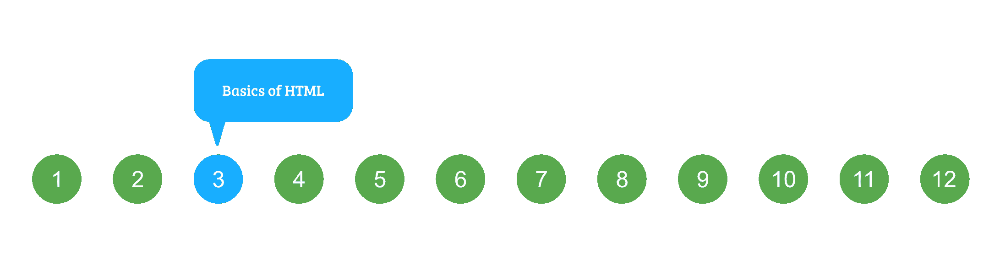

# HTML 课程| HTML 基础知识

> 原文:[https://www.geeksforgeeks.org/html-course-basics-of-html/](https://www.geeksforgeeks.org/html-course-basics-of-html/)

***航向导航***



在本文中，我们将浏览编写 HTML 所需的所有基本内容。在开始用 HTML 编码时，我们必须考虑和了解各种标签。这些标签有助于脚本或网页中元素的组织和基本格式。这些循序渐进的步骤将指导你完成编写 HTML 的过程。
[**HTML 段落**](https://www.geeksforgeeks.org/html-paragraph-2/)
这些标签帮助我们在网页中编写段落语句。它们以 **< p >** 标记开始，以 **< /p >** 结束。这里 **< br >** 标签用于断线，充当回车。 **< br >** 为空标记。
**示例** :

## 超文本标记语言

```html
<html>
<head>
    <title>GeeksforGeeks</title>
</head>
<body>
    <h1>Hello GeeksforGeeks</h1>

<p>
    A Computer Science portal for geeks<br>
    A Computer Science portal for geeks<br>
    A Computer Science portal for geeks<br>
    </p>

</body>
</html>
```

**输出** :


[**HTML 水平线**](https://www.geeksforgeeks.org/html-hr-tag/)
**<【HR】>**标签用于将页面分成多个部分，借助从页面左侧到右侧的水平线创建水平边距。这也是一个空标签，不接受任何附加语句。
**示例** :

## 超文本标记语言

```html
<html>
<head>
    <title>GeeksforGeeks</title>
</head>
<body>
    <h1>Hello GeeksforGeeks</h1>

<p>
    A Computer Science portal for geeks<br>
    A Computer Science portal for geeks<br>
    A Computer Science portal for geeks<br>
    </p>

    <hr>

<p>
    A Computer Science portal for geeks<br>
    A Computer Science portal for geeks<br>
    A Computer Science portal for geeks<br>
    </p>

    <hr>

<p>
    A Computer Science portal for geeks<br>
    A Computer Science portal for geeks<br>
    A Computer Science portal for geeks<br>
    </p>

    <hr>
</body>
</html>
```

**输出** :


[**HTML 图片**](https://www.geeksforgeeks.org/html-images/)
图片标签是用来将图片插入我们的网页的。要插入的图像的来源放在****标签内。
**示例** :

## 超文本标记语言

```html
<html>
<head>
    <title>GeeksforGeeks</title>
</head>
<body>
    
</body>
</html>
```

**输出** :


[**HTML–属性**](https://www.geeksforgeeks.org/html-attributes/)
属性用于提供关于元素的额外信息。

*   所有的 HTML 元素都可以有属性。属性提供关于元素的附加信息。
*   它需要两个参数:名称和值。这些定义了元素的属性，并被放置在元素的开始标记内。name 参数采用我们希望分配给元素的属性的名称，该值采用属性的值或属性名称的范围，这些属性名称可以在元素上对齐。
*   每个名字都有一些必须用引号括起来的价值。

[**HTML–注释**](https://www.geeksforgeeks.org/html-comments/)
用于在 HTML 代码中插入注释。使用注释，特别是在复杂的代码中，是编码的最佳实践，这样编码者和读者可以得到理解的帮助。

*   它只是一段被网络浏览器擦除的代码，即不被浏览器显示。
*   它帮助编码者/代码阅读者识别复杂源代码中的代码。

**HTML 注释的语法:**

## 超文本标记语言

```html
<!-- Write your comments here -->
```

**例:**

## 超文本标记语言

```html
<!DOCTYPE html>
<html>

<body>

   <!-- there is a comment -->

<p>geeksforgeeks.</p>

</body>

</html>
```

**输出:**

```html
geeksforgeeks.
```

**HTML–list**
**什么是列表？**
列表是短信息的记录，如人名，通常每行写或印一个单一的东西，并以一种使特定的东西容易找到的方式排序。
**例如** :

*   购物清单
*   待办事项列表

[**HTML 中的列表**](https://www.geeksforgeeks.org/html-lists/)
HTML 提供了三种指定信息列表的方式。所有列表必须包含一个或多个列表
元素。
可以在 HTML 中使用的列表类型有:

*   **ul :** 无序列表。这将使用普通项目符号列出项目。
*   **ol :** 有序列表。这将使用不同的数字方案来列出您的项目。
*   **dl :** 定义列表。这将按照字典中的排列方式排列您的项目。

**关于 HTML 的更多信息，请参考**:[https://www.geeksforgeeks.org/html-tutorials/](https://www.geeksforgeeks.org/html-tutorials/)T4】

**支持的浏览器:**

*   谷歌 Chrome
*   微软边缘
*   火狐浏览器
*   歌剧
*   旅行队

[<< PREVIOUS](https://www.geeksforgeeks.org/html-course-first-web-page-printing-hello-world/) [NEXT >>](https://www.geeksforgeeks.org/html-course-starting-the-project-creating-directories/)