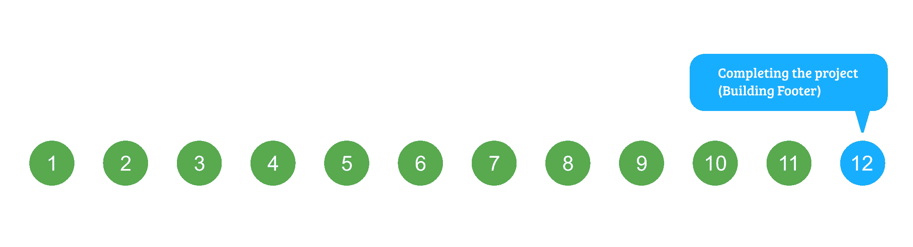
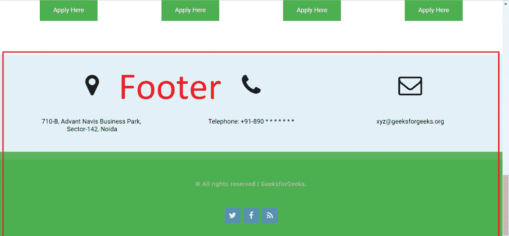
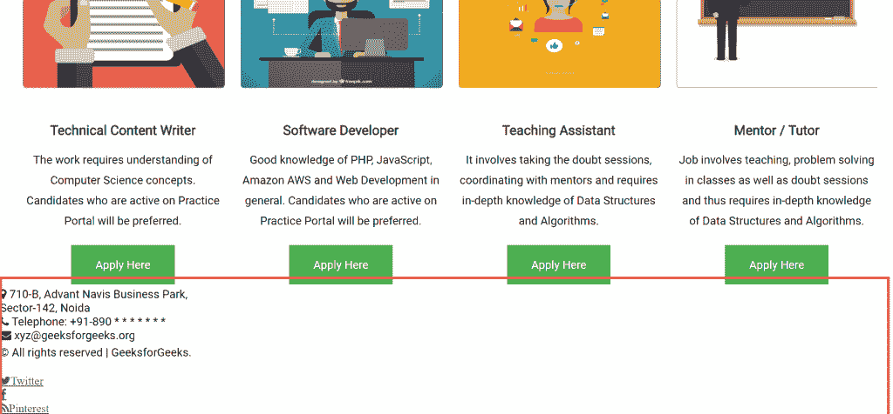
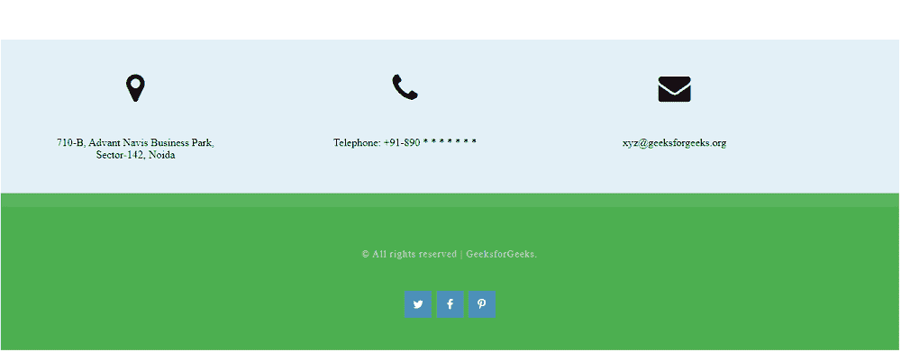

# HTML 课程|建筑页脚

> 原文:[https://www.geeksforgeeks.org/html-course-building-footer/](https://www.geeksforgeeks.org/html-course-building-footer/)

***航向导航***



所以，我们已经完成了网站的所有部分，除了页脚。那么，让我们来看看我们的最终页脚会是什么样子:



我们的页脚主要由两部分组成:

*   **公司详情**:包含地址详情、电话详情、邮箱详情三栏。
*   **版权信息**:包含版权信息和社交媒体句柄链接。

在我们开始构建页脚之前。建议去这个链接一次: [**字体牛逼图标**](https://fontawesome.com/v4.7.0/icons/) 。
我们将在页脚的不同位置使用字体棒极了的图标。要使用 fontawesome 图标，请遵循以下步骤:

*   包括字体真棒 CSS。将下面的代码粘贴在 index.html 文件顶部的头牌之间。

## 超文本标记语言

```html
<link rel="stylesheet" href="https://cdnjs.cloudflare.com/ajax/libs/font-awesome/4.7.0/css/font-awesome.min.css">
```

*   现在，要使用图标，只需将下面的类添加到 span 标签中。

```html
<span class="fa fa-icon_name"></span>

Where, icon_name is the name of the icon.
```

让我们现在开始**编写网站页脚**的 HTML 结构。我们将页脚分为两部分，即*公司详情*和*版权信息*。
遵循以下步骤:

1.  创建两个 div，类名分别为“公司详情”和“版权”。
2.  “公司详细信息”类 div 的步骤:
    *   添加一个名为“row”的 div 类。
    *   在前一个 div 中添加三个 div，id 分别为 col1、col2 和 col3。
    *   为每个列 div 声明两个 span 标记。一个是字体棒极了的图标，第二个是信息。
3.  类别为“版权”的 div 的步骤:
    *   添加一个段落元素来显示文本:“保留所有权利| GeeksforGeeks。”
    *   添加三个元素的无序列表来显示三个社交媒体图标。

下面是页脚的完整 HTML 代码:

## 超文本标记语言

```html
<!-- Footer Menu -->
    <footer id="footer">

        <!-- Company Details -->
        <!-- 1\. Address
        2\. Contact Number
        3\. Enquiry Mail
    -->
        <div class="company-details">
            <div class="row">
                <div id="col1">
                    <span id="icon" class="fa fa-map-marker"></span>

                    <span>
                    710-B, Advant Navis Business Park,
                    <br />Sector-142, Noida
                </span>
                </div>

                <div id="col2">
                    <span id="icon" class="fa fa-phone"></span>

                    <span>
                    Telephone: +91-890 * * * * * * *
                </span>
                </div>

                <div id="col3">
                    <span id="icon" class="fa fa-envelope"></span>
                    <span>xyz@geeksforgeeks.org</span>
                </div>
            </div>
        </div>

        <!-- Copyright Section -->
        <div class="copyright">

<p>© All rights reserved | GeeksforGeeks.</p>

            <ul class="contact">
                <li>
                    <a href="#" class="fa fa-twitter">

                    </a>
                </li>

                <li>
                    <a href="#" class="fa fa-facebook">

                    </a>
                </li>

                <li>
                    <a href="#" class="fa fa-pinterest-p">

                    </a>
                </li>
            </ul>
        </div>
    </footer>
```

看下图中**红色标记部分**。这就是网站页脚现在的样子:



现在让我们给页脚添加样式。

**将样式添加到 div“网站-详细信息”**

*   **首先设置基本布局**样式:设置基本边距、填充、背景色，将文字居中对齐。
    将下面的 CSS 代码添加到你的风格中

## 半铸钢ˌ钢性铸铁(Cast Semi-Steel)

```html
.company-details{
    overflow: hidden;
    padding: 3em 0em;
    background: #E3F0F7;
    text-align: center;
    margin-top: 5em;
}
```

*   **将三列排成一行**:将三列全部向左浮动，并为每一列指定 320 像素的宽度。
    将下面的 CSS 代码添加到你的 style.css 文件中:

## 半铸钢ˌ钢性铸铁(Cast Semi-Steel)

```html
#footer #col1,
#footer #col2,
#footer #col3{
    float: left;
    width: 320px;
    padding: 0px 40px 0px 40px;
}
```

*   **为字体添加样式超赞图标**:将图标的字体大小设置为 3em，下边距为 1em，并以块的形式显示。
    将下面的 CSS 代码添加到你的 style.css 文件中:

## 半铸钢ˌ钢性铸铁(Cast Semi-Steel)

```html
#footer #icon{
    display: block;
    margin-bottom: 1em;
    font-size: 3em;
}
```

**将样式添加到“版权”分区**

*   **为基本布局添加样式**:设置基本边距、填充、背景颜色等。版权类的。
    将下面的 CSS 代码添加到你的 style.css 文件中:

## 半铸钢ˌ钢性铸铁(Cast Semi-Steel)

```html
.copyright
{
    overflow: hidden;
    padding: 3em 0em;
    border-top: 20px solid rgba(255, 255, 255, 0.08);
    text-align: center;
    background: #4CAF50;
}
```

*   **为段落元素**添加样式:为存储在 **< p >** 标签中的版权信息添加样式。添加字母间距、颜色等。
    将下面的 CSS 代码添加到你的 style.css 文件中:

## 半铸钢ˌ钢性铸铁(Cast Semi-Steel)

```html
.copyright p
{
    letter-spacing: 1px;
    font-size: 0.90em;
    color: rgba(255, 255, 255, 0.6);
}
```

*   **为锚点标签添加样式**:将锚点标签和文字装饰的颜色设置为无:

## 半铸钢ˌ钢性铸铁(Cast Semi-Steel)

```html
.copyright a
{
    text-decoration: none;
    color: rgba(255, 255, 255, 0.8);
}
```

如果您现在在浏览器中打开**index.html**文件，您将看到如下所示的页脚:



上面的页脚看起来不错，唯一不同的是 facebook、twitter 等社交图标的显示。让我们解决这个问题。剩下的最后一件事就是给社交媒体图标添加样式。

**向社交图标**添加样式:

*   从名为“contact”的 ul 或类中删除边距，添加填充并将列表样式设置为无:

## 半铸钢ˌ钢性铸铁(Cast Semi-Steel)

```html
ul.contact{
    margin: 0;
    padding: 2em 0em 0em 0em;
    list-style: none;
}
```

*   将列表项设置为显示为内嵌块，以便图标可以水平显示而不是垂直显示。也给列表项添加填充和字体大小。

## 半铸钢ˌ钢性铸铁(Cast Semi-Steel)

```html
ul.contact li{
    display: inline-block;
    padding: 0em 0.10em;
    font-size: 1em;
}
```

*   添加以上两种样式后，图标现在将水平排列在版权分区的中心。进行上述更改后，在浏览器中刷新并查看结果。
*   最后一件事是为社交图标添加背景。为此，为每个列表项的锚点标签添加以下样式:

## 半铸钢ˌ钢性铸铁(Cast Semi-Steel)

```html
ul.contact li a{
    color: #FFF;
    display: inline-block;
    background: #4C93B9;
    width: 40px;
    height: 40px;
    line-height: 40px;
    text-align: center;
}
```

**网站页脚完整的 CSS 代码如下:**

## 半铸钢ˌ钢性铸铁(Cast Semi-Steel)

```html
/**********************************/
/*          Styling Footer        */
/**********************************/

/*** Adding Styles to Company Details ***/
.company-details{
    overflow: hidden;
    padding: 3em 0em;
    background: #E3F0F7;
    text-align: center;
    margin-top: 5em;
}

#footer #col1,
#footer #col2,
#footer #col3{
    float: left;
    width: 320px;
    padding: 0px 40px 0px 40px;
}

#footer #icon{
    display: block;
    margin-bottom: 1em;
    font-size: 3em;
}

/*** Adding Styles to Copyright Div ***/
.copyright
{
    overflow: hidden;
    padding: 3em 0em;
    border-top: 20px solid rgba(255, 255, 255, 0.08);
    text-align: center;
    background: #4CAF50;
}

.copyright p
{
    letter-spacing: 1px;
    font-size: 0.90em;
    color: rgba(255, 255, 255, 0.6);
}

.copyright a
{
    text-decoration: none;
    color: rgba(255, 255, 255, 0.8);
}

/* Styling Social Icons */
ul.contact{
    margin: 0;
    padding: 2em 0em 0em 0em;
    list-style: none;
}

ul.contact li{
    display: inline-block;
    padding: 0em 0.10em;
    font-size: 1em;
}

ul.contact li a{
    color: #FFF;
    display: inline-block;
    background: #4C93B9;
    width: 40px;
    height: 40px;
    line-height: 40px;
    text-align: center;
}
```

**支持的浏览器:**

*   谷歌 Chrome
*   微软边缘
*   火狐浏览器
*   歌剧
*   旅行队

[<< PREVIOUS](https://www.geeksforgeeks.org/html-course-building-main-content-section-3/) [FINAL QUIZ](https://www.geeksforgeeks.org/html-course-practice-quiz-2/)