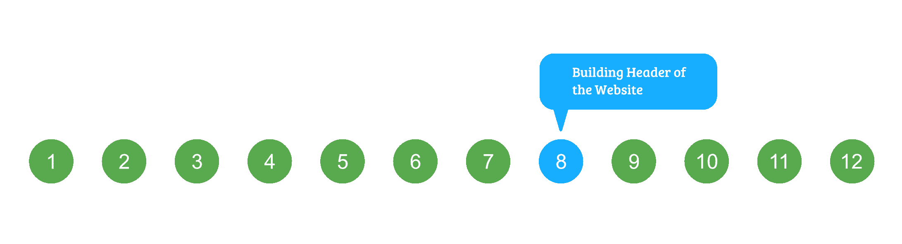
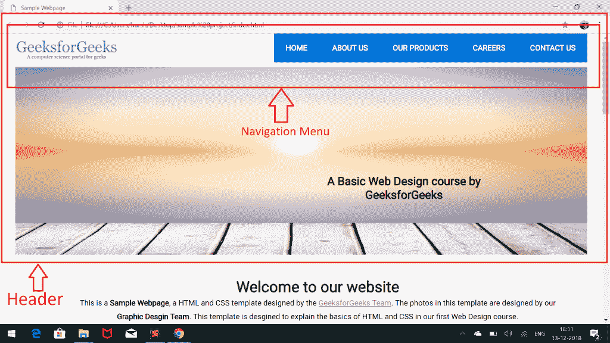
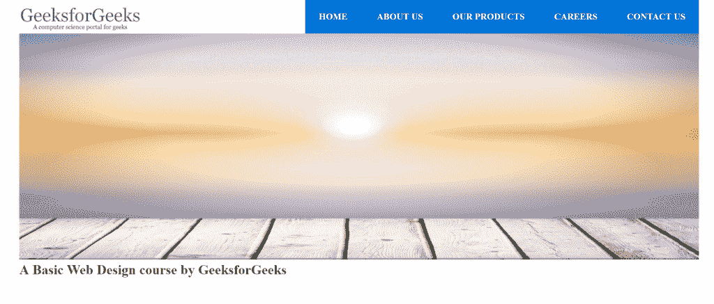
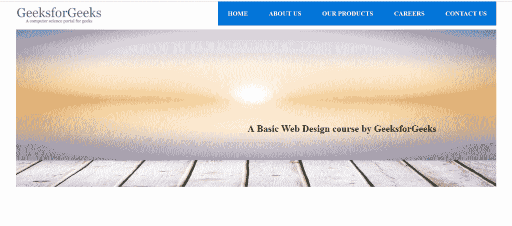

# HTML 课程|网站建设标题

> 原文:[https://www . geesforgeks . org/html-课程建设-网站标题/](https://www.geeksforgeeks.org/html-course-building-header-of-the-website/)

***航向导航***



到目前为止，我们已经为网站的标题创建了导航栏。下一步要完成的是在图片上方包含图片和文字，如下图截图所示:



让我们再次看看我们的 index.html 文件中的标题代码的**部分。代码的高亮部分显示了标题的图像菜单:** 

## 超文本标记语言

```html
<!-- Header Menu of the Page -->
<header>

    <!-- Top header menu containing
        logo and Navigation bar -->
    <div id="top-header">

        <!-- Logo -->
        <div id="logo">
            
        </div>   

        <!-- Navigation Menu -->
        <nav>
            <ul>
                <li class="active"><a href="#">Home</a></li>
                <li><a href="#">About Us</a></li>
                <li><a href="#">Our Products</a></li>
                <li><a href="#">Careers</a></li>
                <li><a href="#">Contact Us</a></li>
            </ul>
        </nav>
    </div>   

    <!-- Image menu in Header to contain an Image and
        a sample text over that image -->
    <div id="header-image-menu">

    </div>
</header>
```

为了完成图像菜单，我们首先需要在 id 为" header-image-menu "的 div 标签中添加图像和文本，如上面的代码所示。
**添加图像** :

*   [**点击这里**](https://media.geeksforgeeks.org/wp-content/cdn-uploads/slider.jpg) 下载给定的图片。
*   将其添加到项目的图像文件夹中。
*   用 **id = "header-image-menu"** 将其包含在 div 中。

**添加文本**:在< h2 >标签中添加文本，并给标签一个 id = "image-text "用于添加样式。
下面是添加图像和文本后标题菜单的最终 HTML 代码:

## 超文本标记语言

```html
<!-- Header Menu of the Page -->
<header>

    <!-- Top header menu containing
         logo and Navigation bar -->
    <div id="top-header">

        <!-- Logo -->
        <div id="logo">
            
        </div>   

        <!-- Navigation Menu -->
        <nav>
            <ul>
                <li class="active"><a href="#">Home</a></li>
                <li><a href="#">About Us</a></li>
                <li><a href="#">Our Products</a></li>
                <li><a href="#">Careers</a></li>
                <li><a href="#">Contact Us</a></li>
            </ul>
        </nav>
    </div>   

    <!-- Image menu in Header to contain an Image and
         a sample text over that image -->
    <div id="header-image-menu">
        
        <h2 id = "image-text">
            A Basic Web Design course by GeeksforGeeks
        </h2>
    </div>
</header>
```

我们的网页现在看起来像下面的截图:



能否指出**上图**有什么问题？答案是文本位于图像下方，而不是模板中显示的正确位置。
我们将不得不使用 CSS 为文本和图像添加样式，以便将文本放在图像上。让我们从添加 CSS 开始。

*   **设置主图像菜单的样式(#header-image-menu)** :给图像菜单父菜单一个顶部边距为 10px，并将其位置设置为相对。
    将以下代码添加到 style.css:

## 半铸钢ˌ钢性铸铁(Cast Semi-Steel)

```html
#header-image-menu{
    top: 10px;
    position: relative;
}
```

*   **在图像菜单**中设置图像的样式:将图像的宽度设置为父图像的 100%，并移除边距和填充。
    将以下代码添加到 style.css:

## 半铸钢ˌ钢性铸铁(Cast Semi-Steel)

```html
#header-image-menu img{
    width: 100%;
    margin: none;
    padding: none;
}
```

*   **定位文本(#image-text)** :首先将文本的位置设置为绝对，从左到上留出适当的边距。使用 translate()函数设置颜色并将文本翻译 30%。
    将以下代码添加到 style.css:

## 半铸钢ˌ钢性铸铁(Cast Semi-Steel)

```html
#image-text{
    position: absolute;
    top: 60%;
    left: 60%;
    font-family: 'Roboto';
    color: #000;
    transform: translate(-30%, -30%);
    text-align: center;
}
```

图像菜单的完整 CSS 代码如下所示:

## 半铸钢ˌ钢性铸铁(Cast Semi-Steel)

```html
/*****************************/
/* Styling Header Image Menu */
/*****************************/
#header-image-menu{
    top: 10px;
    position: relative;
}

#header-image-menu img{
    width: 100%;
    margin: none;
    padding: none;
}

#image-text{
    position: absolute;
    top: 60%;
    left: 60%;
    font-family: 'Roboto';
    color: #000;
    transform: translate(-30%, -30%);
    text-align: center;
}
```

现在在浏览器中打开**index.html**，您将看到与课程开始时示例视频中显示的完全相同的标题。



我们已经完成了建立我们网站的标题。

**支持的浏览器:**

*   谷歌 Chrome
*   微软边缘
*   火狐浏览器
*   歌剧
*   旅行队

[<< PREVIOUS](https://www.geeksforgeeks.org/html-course-creating-navigation-menu/) [NEXT >>](https://www.geeksforgeeks.org/html-course-building-main-content-section-1/)