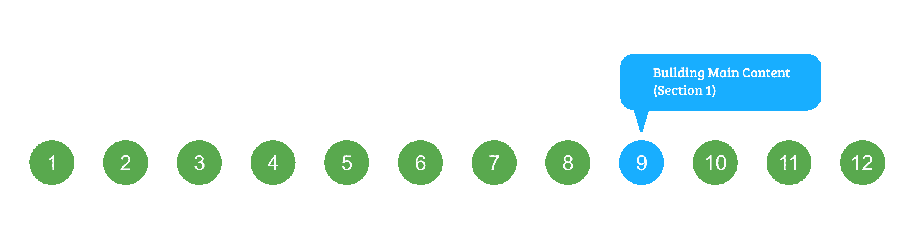

# HTML 课程|构建主要内容–第 1 节

> 原文:[https://www . geesforgeks . org/html-课程-建筑-主要-内容-第 1 节/](https://www.geeksforgeeks.org/html-course-building-main-content-section-1/)

***航向导航***



我们刚刚完成了我们网站的标题构建。让我们开始构建网站的主要内容。正如我们在**创建网站的超文本标记语言布局**时所描述的，主要内容分为以下三个部分:

## 超文本标记语言

```html
<!-- Main content between Header and Footer -->
<main>
    <!-- Section 1 of Main content -->
    <section>

    </section>

    <!-- Section 2 of Main content -->
    <section>

    </section>

    <!-- Section 3 of Main content -->
    <section>

    </section>
</main>
```