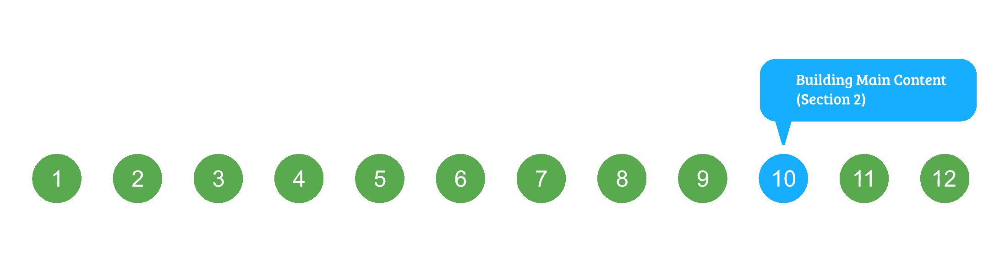
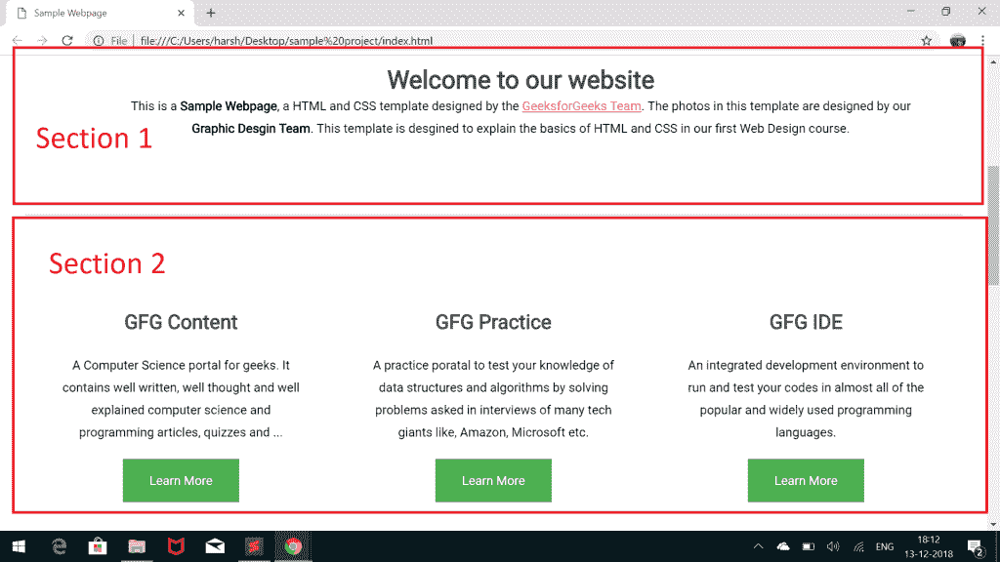
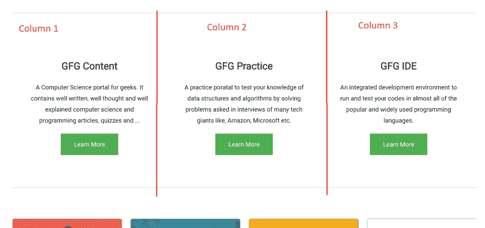
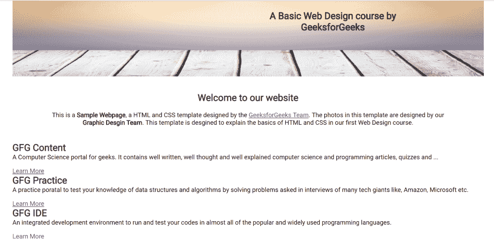
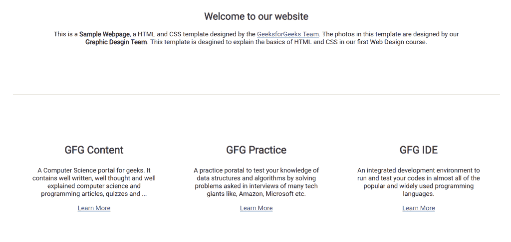
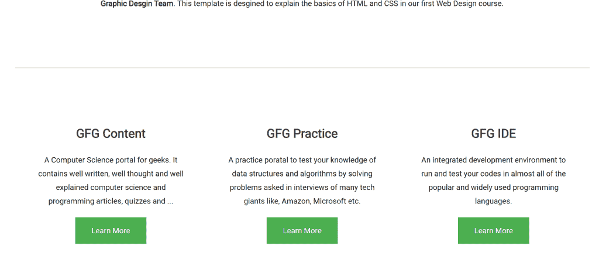

# HTML 课程|构建主要内容–第 2 节

> 原文:[https://www . geesforgeks . org/html-课程-建筑-主要-内容-第 2 节/](https://www.geeksforgeeks.org/html-course-building-main-content-section-2/)

***航向导航***



在上一篇文章中，我们开始构建网站的主要部分，并且已经完成了第一部分。现在让我们进入主要内容的**部分 2** 。
在下图中可以看到主要内容的第二部分:



如果仔细观察，可以说第二节分为三列，如下图:



这在 Web 开发术语中也被称为 **3 列**布局。
让我们开始为我们网站的第二部分编写 HTML，按照以下步骤操作:

1.  用名为*行*的类声明父 div。
2.  在父行 div 中声明三个 div 以包含三列，并分别将它们的 id 指定为 column1、column2 和 column3。
3.  **对于每一列**:
    *   用 class = "column-title "声明一个 div。列的标题。
    *   声明一个段落 **p** 元素来描述内容。
    *   声明一个锚点标签 **<一个>** 来添加一个外部链接，该链接稍后将被设计为一个按钮。

以下是主要内容
第 2 节的完整 HTML 代码

## 超文本标记语言

```html
<!-- Section 2 of Main content -->
<section class="container" id="section-2">
    <div class="row">
        <div id="column1">
            <div class="column-title">
                <h2>GFG Content</h2>
            </div>

<p>
                A Computer Science portal for geeks. It
                contains well written, well thought and
                well explained computer science and
                programming articles, quizzes and ...
            </p>

            <a href="https://www.geeksforgeeks.org"
                target="_blank" class="button">
                Learn More
            </a>
        </div>

        <div id="column2">
            <div class="column-title">
                <h2>GFG Practice</h2>
            </div>

<p>
                A practice poratal to test your knowledge
                of data structures and algorithms by solving
                problems asked in interviews of many tech giants
                like, Amazon, Microsoft etc.
            </p>

            <a href="https://practice.geeksforgeeks.org"
                target="_blank" class="button">
                Learn More
            </a>
        </div>

        <div id="column3">
            <div class="column-title">
                <h2>GFG IDE</h2>
            </div>

<p>
                An integrated development environment to
                run and test your codes in almost all of
                the popular and widely used programming
                languages.
            </p>

            <a href="https://ide.geeksforgeeks.org"
                target="_blank" class="button">
                Learn More
            </a>
        </div>
    </div>
</section>
```

如果您在浏览器中运行 index.html，您将能够看到如下所示的内容:



这个地方看起来很接近我们在主要内容的最后第 2 部分。让我们开始给它添加样式。

*   **添加布局基本样式**:首先将溢出设置为隐藏，添加所有需要的边距和填充。下一步是在该部分的顶部设置 1px 细边框，将其与前一部分分开，并将其中的所有文本居中对齐。
    将下面的 CSS 代码添加到你的风格中

## 半铸钢ˌ钢性铸铁(Cast Semi-Steel)

```html
#section-2{
    overflow: hidden;
    margin-top: 5em;
    padding-top: 1em;
    border-top: 1px solid rgba(0, 0, 0, 0.2);
    text-align: center;
}
```

*   **对齐直列**:下一步是将单行中的所有列一个接一个地对齐。为此，将下面的 CSS 代码添加到你的 style.css 文件中:

## 半铸钢ˌ钢性铸铁(Cast Semi-Steel)

```html
.row #column1,
.row #column2,
.row #column3{
        float: left;
        width: 320px;
        padding: 80px 40px 80px 40px;
}
```

*   **设置栏目标题样式**:接下来要做的一件好事就是设置栏目标题的样式。给他们适当的字体大小和权重，除了默认值。将下面的 CSS 代码添加到你的 style.css 文件中:

## 半铸钢ˌ钢性铸铁(Cast Semi-Steel)

```html
.column-title h2{
    margin: 1em 0em;
    font-size: 1.6em;
    font-weight: 700;
}
```

一旦您成功添加了以上样式，您的**第 2 部分**现在将看起来如下所示:



除了底部的**按钮**外，现在看起来不错。按钮仍然显示为简单的链接。让我们通过添加一些 CSS 来使它们看起来更好。
**造型按钮**
要使按钮看起来好看，请执行以下操作:

*   删除文本装饰。
*   将文本居中对齐。
*   将显示属性设置为“内嵌块”。
*   设置按钮合适的字体大小、颜色和背景颜色。
*   添加填充和边距。
*   将 cursor 属性设置为 pointer，这样每当用户将鼠标指针悬停在按钮上时，鼠标指针就会变成代表指针的漂亮指针。
*   每当用户悬停在按钮上时，使用**:悬停选择器**添加样式。

下面是需要添加到 style.css 文件中的“button”类的完整 CSS 代码:

## 半铸钢ˌ钢性铸铁(Cast Semi-Steel)

```html
.button {
    text-decoration: none;
    text-align: center;
    display: inline-block;
    font-size: 16px;
    background-color: #4CAF50;
    color: white;
    border: 2px solid #4CAF50;
    padding: 16px 32px;
    margin: 4px 2px;
    -webkit-transition-duration: 0.4s; /* Safari */
    transition-duration: 0.4s;
    cursor: pointer;
}

.button:hover {
    background-color: white;
    color: #4CAF50;
}
```

现在，我们网站的**第 2 部分**已经完成，看起来如下所示:



**支持的浏览器:**

*   谷歌 Chrome
*   微软边缘
*   火狐浏览器
*   歌剧
*   狩猎

[<< PREVIOUS](https://www.geeksforgeeks.org/html-course-building-main-content-section-1/) [NEXT >>](https://www.geeksforgeeks.org/html-course-building-main-content-section-3/)