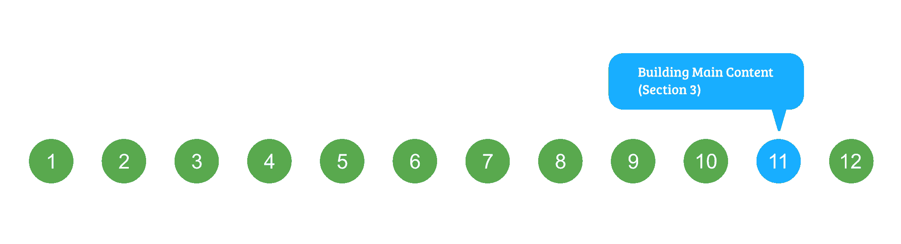

# HTML 课程|构建主要内容–第 3 节

> 原文:[https://www . geesforgeks . org/html-课程-建筑-主要-内容-第 3 节/](https://www.geeksforgeeks.org/html-course-building-main-content-section-3/)

***航向导航***



在前一篇文章中我们已经看到了 **3 列**的布局并完成了**第 2 节**的主要内容。网站的主要内容现在已经差不多完成了。我们只需要构建第 3 节的主要内容。**第 3 节**如下图所示:


如果你仔细看上面的图片，那么可以看到网站的第 3 部分和第 2 部分几乎是一样的。唯一的区别是它有 4 列而不是 3 列，并且每一列在标题之前的顶部都有一个图像。
我们开始为我们网站的**第 3 节**写 HTML，按照下面的步骤:

1.  用名为 row 的类声明父 div。
2.  在父行 div 中声明**四个** div 包含四列，并将它们分别指定为 id 为 column21、column22、column23 和 column24。
3.  从给定的链接下载图片，并保存到你的**图片**文件夹中。
    *   [第 1 列图像](https://media.geeksforgeeks.org/wp-content/cdn-uploads/writer.jpg)。
    *   [第 2 列图像](https://media.geeksforgeeks.org/wp-content/cdn-uploads/developer.jpg)。
    *   [第 3 列图像](https://media.geeksforgeeks.org/wp-content/cdn-uploads/support.jpg)。
    *   [第 4 列图像](https://media.geeksforgeeks.org/wp-content/cdn-uploads/teacher.jpg)。
4.  **对于每一列**:
    *   使用 **< img >** 标签插入相应列的图像。
    *   用 class = "img-title "声明一个 div。列的标题。
    *   为内容描述声明一个段落 p 元素。
    *   声明一个锚点标签 **<一个>** 来添加一个外部链接，它将被设计为一个按钮。我们将使用上一篇文章中创建的按钮。因此，将类“按钮”分配给锚标签。

以下是主要内容
第 3 节的完整 HTML 代码

## 超文本标记语言

```html
<!-- Section 3 of Main content -->
<section class="container" id="section-3">
    <div id="row">

        <!-- Column 1 -->
        <div id="column21">
            

            <div class="img-title">
                <h3>Technical Content Writer</h3>
            </div>

<p>
                The work requires understanding of Computer
                Science concepts. Candidates who are active
                on Practice Portal will be preferred.
            </p>

            <a href="https://www.geeksforgeeks.org/careers/"
                target="_blank" class="button">
                    Apply Here
            </a>
        </div>

        <!-- Column 2 -->
        <div id="column22">

            

            <div class="img-title">
                <h3>Software Developer</h3>
            </div>

<p>
                Good knowledge of PHP, JavaScript, Amazon AWS
                and Web Development in general. Candidates who
                are active on Practice Portal will be
                preferred.
            </p>

            <a href="https://www.geeksforgeeks.org/careers/"
                target="_blank" class="button">
                    Apply Here
            </a>
        </div>

        <!-- Column 3 -->
        <div id="column23">

            

            <div class="img-title">
                <h3>Teaching Assistant</h3>
            </div>

<p>
                It involves taking the doubt sessions,
                coordinating with mentors and requires
                in-depth knowledge of Data Structures
                and Algorithms.
            </p>

            <a href="https://www.geeksforgeeks.org/careers/"
                target="_blank" class="button">
                    Apply Here
            </a>
        </div>

        <!-- Column 4 -->
        <div id="column24">
            

            <div class="img-title">
                <h3>Mentor / Tutor</h3>
            </div>

<p>
                Job involves teaching, problem solving
                in classes as well as doubt sessions and
                thus requires in-depth knowledge of Data
                Structures and Algorithms.
            </p>

            <a href="https://www.geeksforgeeks.org/careers/"
                target="_blank" class="button">
                    Apply Here
            </a>
        </div>
    </div>
</section>
```

现在在浏览器中运行**index.html**文件时，您将能够看到第 3 节的内容，其顺序与添加 CSS 之前的第 2 节的顺序不同。
因此，让我们开始给类添加样式，并完成主要内容的第 3 部分:

*   **添加布局基本样式**:首先将溢出设置为隐藏，添加所有需要的边距和填充。下一步是在该部分的顶部给出 1px 细边框，将其与前一部分分开，并将其中的所有文本对齐到中心。
    将下面的 CSS 代码添加到你的 style.css 文件中:

## 半铸钢ˌ钢性铸铁(Cast Semi-Steel)

```html
#section-3{
    overflow: hidden;
    padding-top: 5em;
    border-top: 1px solid rgba(0, 0, 0, 0.2);
    text-align: center;
}
```

*   **对齐直列**:下一步是将一行中的所有列一个接一个地对齐。为此，将下面的 CSS 代码添加到你的 style.css 文件中:

## 半铸钢ˌ钢性铸铁(Cast Semi-Steel)

```html
/* Add fixed width for each column and
   align text to center */
#column21,
#column22,
#column23,
#column24
{
    width: 282px;
    text-align: center;
}

/* Float first 3 columns to left */   
#column21,
#column22,
#column23,
#column24 {
    width: 282px;
    text-align: center;
}

#column21,
#column22,
#column23,
#column24 {
    float: left;
    margin: auto 25px;
}
```

*   **设置栏目标题的样式**:接下来要做的好事情是设置图片下方的栏目标题的样式。给他们合适的字体大小，填充颜色等。除了默认值。将下面的 CSS 代码添加到你的 style.css 文件中:

## 半铸钢ˌ钢性铸铁(Cast Semi-Steel)

```html
.img-title{
    display: block;
    padding-bottom: 1em;
    font-size: 1em;
    color: rgba(0, 0, 0, 0.6);
}
```

*   **对图像进行造型**:我们在栏目中为我们的图像增加了两个类，分别是*图像*和*图像-全*。

## 半铸钢ˌ钢性铸铁(Cast Semi-Steel)

```html
.image
{
    display: inline-block;
    border: 1px solid rgba(0, 0, 0, .5);
    border-radius: 5px;
}

.image img
{
    display: block;
    width: 100%;
}

.image-full
{
    display: block;
    width: 100%;
    margin: 0 0 3em 0;
}

.img-title{
    display: block;
    padding-bottom: 1em;
    font-size: 1em;
    color: rgba(0, 0, 0, 0.6);
}
```