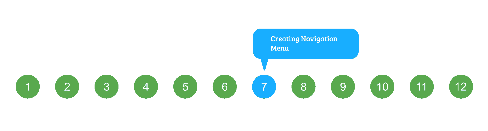
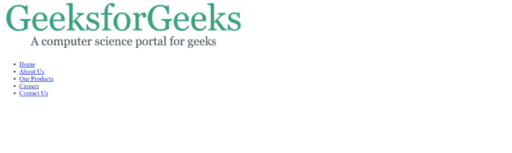

# HTML 课程|创建导航菜单

> 原文:[https://www . geesforgeks . org/html-课程-创建-导航-菜单/](https://www.geeksforgeeks.org/html-course-creating-navigation-menu/)

***航向导航***



在上一篇文章中，我们使用 HTML 元素和标签创建了网站的整个结构。现在让我们开始部分地构建网站。

网站第一部分是**标题**。因此，我们将创建的第一件事是网页标题中的导航菜单。

**导航栏包含**:

*   向左对齐的徽标。
*   向右对齐的五个项目的菜单。

让我们从我们的**index.html**文件来看看标题菜单的代码部分。下面是标题菜单的代码部分，突出显示的部分是顶部导航栏:

## 超文本标记语言

```html
<!-- Header Menu of the Page -->
<header>
    <!-- Top header menu containing
       logo and Navigation bar -->
    <div id="top-header">

        <!-- Logo -->
        <div id="logo">

        </div>   

        <!-- Navigation Menu -->
        <nav>

        </nav>
    </div>   

    <!-- Image menu in Header to contain an Image and
         a sample text over that image -->
    <div id="header-image-menu">

    </div>
</header>
```

**第一个任务**是为 logo 添加图像。**包含图像和创建徽标的步骤**:

*   通过[点击这里](https://media.geeksforgeeks.org/wp-content/cdn-uploads/logo.png)下载图片。
*   将图像复制并粘贴到目录:根目录/图像。其中**根**是我们项目的顶级目录。在我们的例子中，它被命名为“样本项目”。
*   使用 img 标记将图像包含在代码中。

**第二个任务**是在标题菜单的导航区内创建一个 HTML 无序列表:

*   在导航菜单部分添加一个无序列表，包含 5 个列表项，分别是“主页”、“关于我们”、“我们的产品”、“职业”和“联系我们”。

添加上述两项后，Header 部分的代码如下所示:

## 超文本标记语言

```html
<!-- Header Menu of the Page -->
<header>

    <!-- Top header menu containing
         logo and Navigation bar -->
    <div id="top-header">

        <!-- Logo -->
        <div id="logo">
            
        </div>   

        <!-- Navigation Menu -->
        <nav>
          <div id="menu">
            <ul>
                <li class="active"><a href="#">Home</a></li>
                <li><a href="#">About Us</a></li>
                <li><a href="#">Our Products</a></li>
                <li><a href="#">Careers</a></li>
                <li><a href="#">Contact Us</a></li>
            </ul>
          </div>
        </nav>
    </div>   

    <!-- Image menu in Header to contain an Image and
         a sample text over that image -->
    <div id="header-image-menu">

    </div>
</header>
```

如果您现在在浏览器中打开 index.html 文件，您将看到以下输出:



这看起来与我们在最终项目截图中看到的非常不同。这是因为我们的网站目前缺少 CSS。也就是说，我们刚刚创建了导航栏的结构，为了使它看起来美观，我们将不得不使用 **CSS** 添加样式。

稍后我们将设计导航栏，但首先创建一个名为“ **style.css** ”的文件，并将其添加到文件夹“**示例项目/css** ”中。还包括通过在标题标签之间添加下一行而创建到“index.html”文件的 CSS 文件。

## 超文本标记语言

```html
<link rel="stylesheet" href="css/style.css">
```

在我们开始设计导航菜单之前，首先需要做的是为 HTML 元素设置默认的 CSS 值。**复制并粘贴**以下代码到你的 **style.css** 文件中:

## 半铸钢ˌ钢性铸铁(Cast Semi-Steel)

```html
html, body{
    height: 100%;
}

body{
    margin: 0px;
    padding: 0px;
    background: #FFFFFF;
    font-family: 'Roboto';
    font-size: 12pt;
}

h1, h2, h3{
    margin: 0;
    padding: 0;
    color: #404040;
}

p, ol, ul{
    margin-top: 0;
}

p {
    line-height: 180%;
}

ol, ul{
    padding: 0;
    list-style: none;
}

.container{   
    /* Set width of container to
        1200px and align center */
    margin: 0px auto;
    width: 1200px;
}
```

正如您在上面的 CSS 中看到的，我们已经为项目所需的几乎每个有用的 HTML 元素设置了默认值。另外，我们创建了一个名为“**容器**”的 CSS 类。这基本上定义了一个宽度为 1200px 的容器，其中的所有文本都居中对齐。将这个名为**容器**的类添加到 **<标题>** 标签中。
下一步是**给我们的 HTML 元素分配一些 id，然后在 CSS 文件中使用这些 id 来设置它们的样式**。在这里，我们已经为 HTML 元素分配了 id，正如您在上面的代码中看到的那样。让我们开始给它们添加样式。

下面是导航栏样式的分步指南:

*   **整体造型表头**:表头标签不需要太多造型。标题标签只需要设置为“溢出:隐藏”，以防止浏览器调整大小时窗口溢出。
    将以下代码添加到 style.css 中:

## 半铸钢ˌ钢性铸铁(Cast Semi-Steel)

```html
header{

    overflow: hidden;
}
```

*   **设置导航栏样式(#顶部标题)**:为导航栏设置 60px 的固定高度，并将文本居中对齐。
    将以下代码添加到 style.css 中:

## 半铸钢ˌ钢性铸铁(Cast Semi-Steel)

```html
#top-header{

    text-align: center;
    height: 60px;
}
```