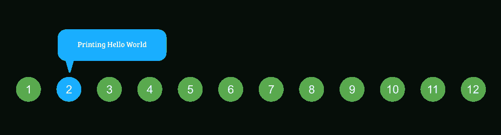
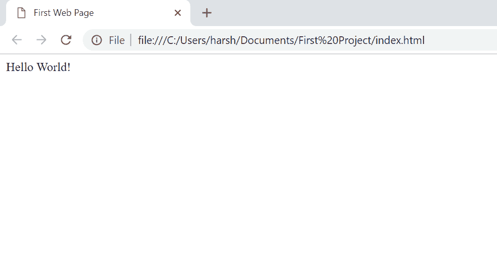
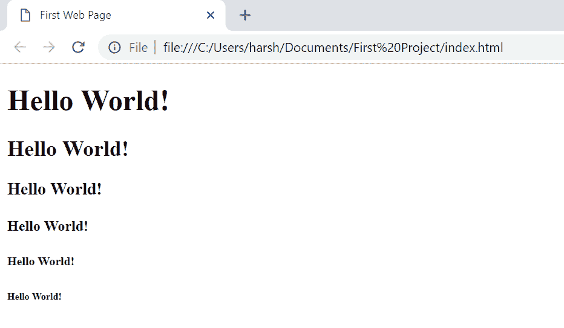

# HTML 课程|第一网页|打印 Hello World

> 原文:[https://www . geesforgeks . org/html-课程-第一-网页-打印-hello-world/](https://www.geeksforgeeks.org/html-course-first-web-page-printing-hello-world/)

***航向导航***



到目前为止，我们已经了解了 HTML 文档的结构、标签等。让我们利用这些知识来创建我们的第一个网页，它将打印文本**“你好，世界！”**在屏幕上。
打开你的文本编辑器，在里面输入下面的代码，并以“index.html”的名称保存。

**注意** : HTML 文件以文件扩展名**保存。html**

**代码:index.html**

## 超文本标记语言

```html
<!DOCTYPE html>

<html>
    <head>
        <title>
            First Web Page
        </title>
    </head>

    <body>
        Hello World!
    </body>
</html>
```

**输出**:在网页浏览器中打开文件，会看到下面的输出。



是的，在网页上打印任何东西都那么容易。您不需要编译您的 HTML 代码来在网页中运行它。由于 HTML 是一种脚本语言，您只需更改代码并点击**刷新**按钮，更改就会立即反映到您的网页上。

**拍《你好世界》！更大**:文字“你好世界！”似乎显得很小。让我们让它看起来大一点。
我们在之前的文章中已经看到了 **< h1/ >** 标签的用法。这是 HTML 中的**标题标签**，用于表示网页中的标题。

**标题标签**:HTML 定义了六级标题。这六个标题元素是 h1、h2、h3、h4、h5 和 h6；h1 是最高级别，h6 是最低级别。
让我们分别使用这六个不同的标题标签来打印“你好，世界！”看看有什么不同。使用以下代码在**index.html**修改您的代码:

**代码:index.html**

## 超文本标记语言

```html
<!DOCTYPE html>

<html>
    <head>
        <title>
            First Web Page
        </title>
    </head>

    <body>
        <h1>Hello World!</h1>
        <h2>Hello World!</h2>
        <h3>Hello World!</h3>
        <h4>Hello World!</h4>
        <h5>Hello World!</h5>
        <h6>Hello World!</h6>
    </body>
</html>
```

**输出**:在刷新网页的时候你会看到输出会变成这个



**支持的浏览器:**

*   谷歌 Chrome
*   微软边缘
*   火狐浏览器
*   歌剧
*   旅行队

**了解更多标题标签，请参考:** [HTML |标题](https://www.geeksforgeeks.org/html-heading/)。