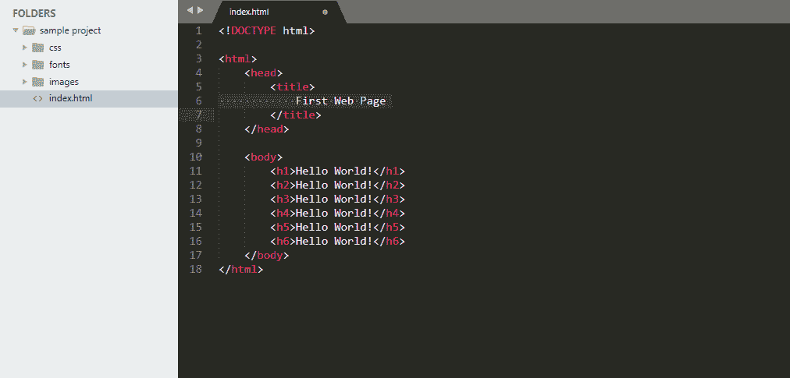

# HTML 课程–开始项目|创建目录

> 原文:[https://www . geesforgeks . org/html-课程-启动-项目-创建-目录/](https://www.geeksforgeeks.org/html-course-starting-the-project-creating-directories/)

***航向导航***

我们已经学习了很多关于 HTML 的东西。我们知道:

*   网页的结构。
*   什么是标签和元素？
*   一些最常用的基本标签的详细说明。
*   创建了我们的第一个网页来打印“你好，世界！”大小不一。

**先决条件**:在开始项目之前，我们首先需要下载一个合适的代码编辑器来编写我们的代码。下面给出了一些流行的 HTML 文本编辑器:

*   VS 代码
*   笔记本
*   记事本++
*   崇高的文本 3
*   原子

现在让我们从介绍本课程时看到的项目开始。

首先要做的是创建目录。也就是说，我们需要创建文件夹和文件来编写代码，并为一个良好编译和干净的项目保持它们的结构。下面是需要的文件和文件夹列表:

您可以在上面的图片中清楚地看到我们在编辑器左侧栏的项目中使用的文件夹和文件。但是这里出现了几个问题:

*   为什么创建这么多文件夹很重要？
*   创建文件夹的惯例是什么？
*   文件夹和文件的命名有什么约定吗？

所以，这些是第一次创建项目的每个人都会想到的几个基本问题。

**答案** :

1.  如果您不想创建任何文件夹，而是将所有文件、图像等保存在根目录中，并在任何需要的地方正确链接它们，您的项目仍然可以正常工作。但这还不够。为一组单独的文件制作单独的文件夹，使事情变得有条理，容易被其他人理解。例如，将所有图像保存在名为“image”的单独文件夹中，将所有样式表保存在名为“CSS”的文件夹中，等等。
2.  做这件事没有标准的惯例。每个组织都创建自己的一套规则来保持事情的结构化。但是遵循的基本方法是为一组单独的文件保留单独的文件夹，如上所述。
3.  同样，除了“index.html”，没有任何命名文件和文件夹的标准惯例。名为“index.html”的页面是浏览器视为主页的项目的基础。因此，您必须将您的主页命名为“index.html”，对于其余的文件和文件夹，您可以将它们命名为最能描述其内容的任何名称。

现在让我们深入了解一下我们为项目创建的目录的细节:

*   **示例项目**:这是我们项目的根目录，其中包含了我们在构建项目时将要创建的所有文件夹和文件。
*   **css** :这个文件夹会包含我们用来设计项目风格的所有 css 文件。目前，我们保持这个文件夹为空。
*   **字体**:该文件夹将包含项目中使用的所有字体文件。
*   **图片**:这个文件夹包含了我们将在项目中使用的所有图片。目前，这是空的。
*   **index.html**:名为“index.html”的页面是浏览器认为是主页的项目的基础。当我们的网站加载到浏览器中时，里面的所有东西都会被渲染。

[< < PREVIOUS](https://www.geeksforgeeks.org/html-course-basics-of-html/)

[NEXT>T3](https://www.geeksforgeeks.org/html-course-understanding-and-building-project-structure/)