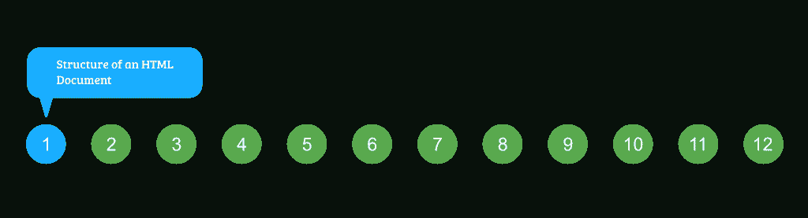
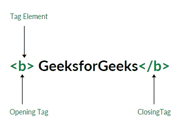
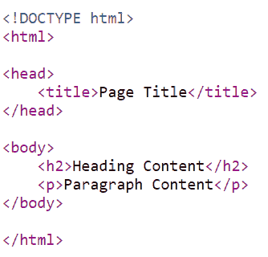

# 超文本标记语言课程|超文本标记语言文档的结构

> 原文:[https://www . geesforgeks . org/html-课程-html-文档结构/](https://www.geeksforgeeks.org/html-course-structure-of-an-html-document/)

***航向导航***



**< HTML >** 是浏览器用来操作文本、图像和其他内容以所需格式显示的标记语言。
**HTML 中的标签**:标签是 HTML 文档中最重要的部分之一。HTML 使用一些预定义的标签告诉浏览器关于内容显示属性，即如何显示特定的给定内容。例如，要创建一个段落，必须使用段落标签(< p > < /p >)并且要插入图像，必须使用 img 标签(< img / >)。
HTML 中一般有两类标签:

1.  **成对标签**:这些标签成对出现。也就是说，它们既有开始(< >)标签，也有结束(< / >)标签。
2.  **空标签**:这些标签不需要关闭。

下面是 HTML 中(**)标签的一个例子，它告诉浏览器加粗其中的文本。** 



**Structure of an HTML Document**

一个 HTML 文档主要分为两部分:

*   **HEAD** :这里包含了关于 HTML 文档的信息。例如，页面标题、HTML 版本、元数据等。
*   **BODY** :这里包含了你想要在网页上显示的所有内容。



超文本标记语言文档结构

现在让我们来看看 HTML 的基本结构。这是每个网页必须具备的代码:

## 超文本标记语言

```html
<!DOCTYPE html>

<html>
    <head>
        <title>

        </title>
    </head>

    <body>

    </body>
</html>
```

每个网页都必须包含此代码。下面是上面这段 HTML 代码中使用的每个标签的完整解释:
**<！DOCTYPE html > :** 这个标签用来告诉 html 版本。这目前告诉我们版本是 HTML 5。
**< html > :** 这叫做 html 根元素，用来包装所有的代码。
**<头部> :** 头部标签包含元数据、标题、页面 CSS 等。所有可以在<头>元素内使用的 HTML 元素有: