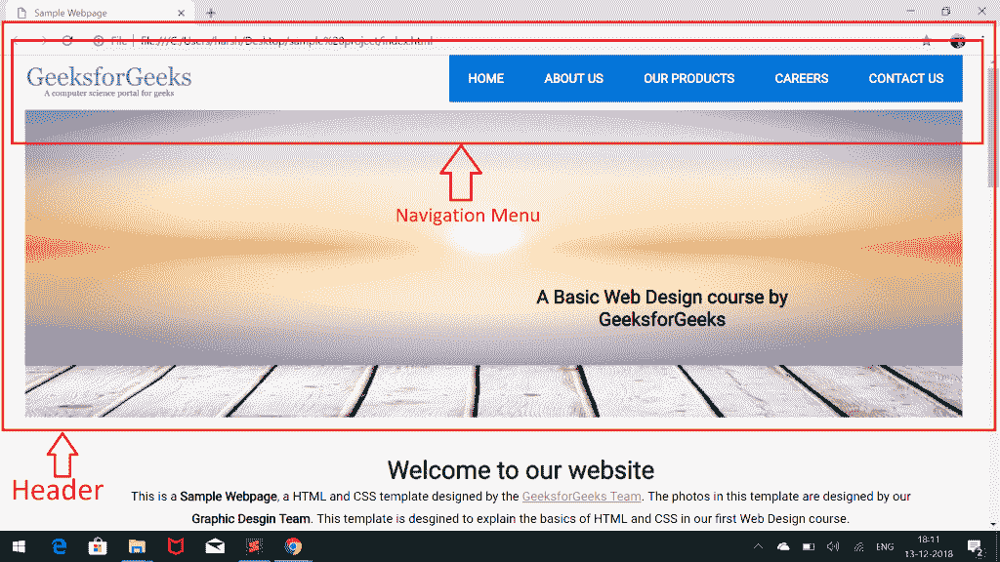
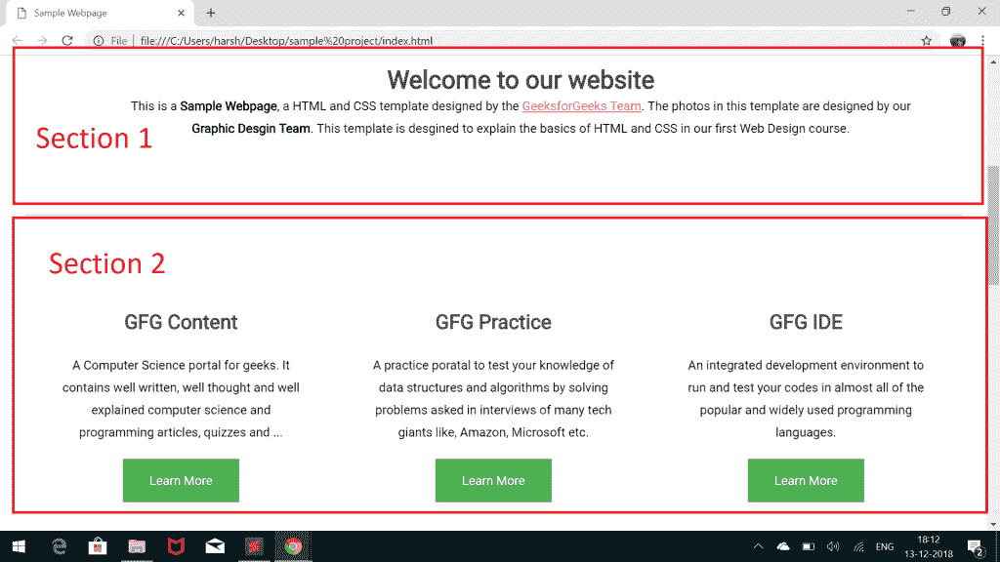

# HTML 课程|理解和构建项目结构

> 原文:[https://www . geesforgeks . org/html-课程-理解-构建-项目-结构/](https://www.geeksforgeeks.org/html-course-understanding-and-building-project-structure/)

***航向导航***


我们已经创建了项目所需的所有目录。让我们开始编写我们的 HTML 代码。因为我们正在设计一个**单页网站**-一个单一网页的网站(没有内部链接)。因此，我们将把所有代码都写在文件“index.html”中。我们不需要为这个项目创建任何其他的 HTML。
在我们开始编写代码之前，请记住这两件事:

*   我们所有的 HTML 代码都将在“index.html”文件中。
*   我们所有的代码都将遵循标准的 HTML5 规则。

**什么是 HTML5？**
HTML5 是 HTML 脚本语言的第五个版本。它支持许多旧版本的 HTML 不支持的新东西。例如:在 HTML5 中有一个新的东西叫做**语义元素**。语义元素有有意义的名称，可以说明内容的类型。例如页眉、页脚、表格等。HTML5 引入了许多语义元素，如下所述，这些元素使开发人员更容易编写和理解代码，并指导浏览器如何对待它们。要了解更多关于 HTML5 的新内容，请访问:

*   【HTML 和 HTML5 的区别
*   [HTML5 |语义](https://www.geeksforgeeks.org/html5-semantics/)

现在让我们从实际编码我们的网站开始。从你的**index.html**中移除一切，只保留标准的 HTML 结构。也就是说，你的 index.html 现在看起来像下面的东西:

## 超文本标记语言

```html
<!DOCTYPE html>

<html>
<head>
<title>Sample Webpage</title>
</head>
<body>

</body>
</html>
```

现在让我们按照 [HTML5 语义](https://www.geeksforgeeks.org/html5-semantics/)将我们的网站分成更小的部分。我们将页面分为以下不同部分:

1.  **表头**:这将进一步分为:
    *   *导航*:导航菜单。
    *   *图像部分*:包含图像。
2.  **MAIN** :这将进一步包含更小的部分来显示不同的信息。
3.  **页脚**

让我们看一下下面的图片，以便清楚地理解上述划分:

*   带有导航菜单和图像的标题:



*   不同截面的车身:



*   页脚:


在您的**index.html**文件中编写以下代码，以创建如上所示的所有部分:

## 超文本标记语言

```html
<!DOCTYPE html>

<html>
    <head>
        <title>
            First Web Page
        </title>
    </head>

    <body>
        <!-- Header Menu of the Page -->
        <header>
            <!-- Top header menu containing
                 logo and Navigation bar -->
            <div id="top-header">
                <!-- Logo -->
                <div id="logo">

                </div>   
                <!-- Navigation Menu -->
                <nav>

                </nav>
            </div>   

            <!-- Image menu in Header to contain an Image and
                 a sample text over that image -->
            <div id="header-image-menu">

            </div>
        </header>

        <!-- Main content between Header and Footer -->
        <main>
            <!-- Section 1 of Main content -->
            <section>

            </section>

            <!-- Section 2 of Main content -->
            <section>

            </section>

            <!-- Section 3 of Main content -->
            <section>

            </section>
        </main>

        <!-- Footer Menu -->
        <footer>

        </footer>
    </body>
</html>
```

如果你运行上面的代码，你会看到一个空的网页，因为到目前为止我们没有打印任何东西。在上面的代码中，我们已经使用 HTML5 中的可用标签概述了网站的框架。在下一篇文章中，我们将看到如何使用样式和 CSS 设计 Header 菜单。

**支持的浏览器:**

*   谷歌 Chrome
*   微软边缘
*   火狐浏览器
*   歌剧
*   狩猎

[<< PREVIOUS](https://www.geeksforgeeks.org/html-course-starting-the-project-creating-directories/) [Take QUIZ](https://www.geeksforgeeks.org/html-course-practice-quiz-1/)