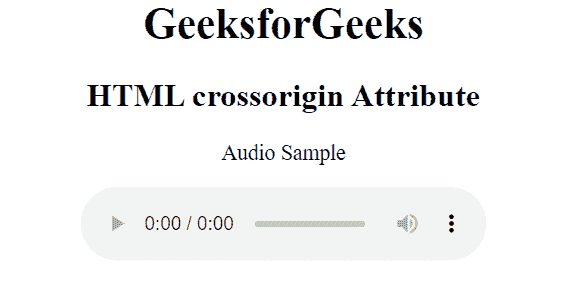

# HTML 跨原点属性

> 原文:[https://www.geeksforgeeks.org/html-crossorigin-attribute/](https://www.geeksforgeeks.org/html-crossorigin-attribute/)

**CORS** 代表跨产地资源共享。它是一种机制，通过这种机制，一个网页请求另一个域从第三方服务器获取资源，如音频、视频、脚本等，而不会泄露它们的凭证信息。如果指定，将使用或不使用凭据发送请求。

****属性用于定义是否支持 CORS 请求。从另一个域或第三方服务器取出资源时。它包括音频等资源。视频图像。链接和脚本。它用于处理 **CORS** 请求，该请求检查允许共享来自其他域的资源是否安全。****

******用法:**用于 [<【音频】>](https://www.geeksforgeeks.org/html5-audio/)[<【视频】>](https://www.geeksforgeeks.org/html5-video/)[<链接>](https://www.geeksforgeeks.org/html-link-tag/)[](https://www.geeksforgeeks.org/html-img-tag/)[<脚本>](https://www.geeksforgeeks.org/html-script-tag/) 。****

******语法:******

```html
**<script crossorigin="anonymous|use-credentials">**
```

******属性值:******

*   ******匿名:**有默认值。它定义了一个 CORS 请求，该请求将在不传递凭据信息的情况下发送。****
*   ******使用-凭证:**跨来源请求将与凭证、cookies 和证书一起发送。****

******示例:**下面的代码说明了***cross origin*****属性在 *<音频>* 元素中的使用。******

## ******超文本标记语言******

```html
****<!DOCTYPE html>
<html>

<head>
    <title>
        HTML crossorigin Attribute
    </title>
</head>

<body>
    <center>
    <h1>GeeksforGeeks</h1>

    <h2>HTML crossorigin Attribute</h2>

<p>Audio Sample</p>

    <!-- Use of crossorigin attribute in audio element -->
    <audio  crossorigin="anonymous" controls>
        <source src="test.mp3" type="audio/mp3">
        <source src="test.ogg" type="audio/ogg">
    </audio>
    <!-- audio tag ends here -->
</body>

</html>****
```

********输出:********

********

******支持的浏览器:******

*   ****谷歌 Chrome 30.0****
*   ****Firefox 13.0****
*   ****Internet Explorer 18.0****
*   ****Opera 12.0****
*   ****Safari 1.0****