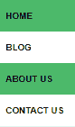
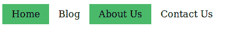

# HTML & CSS | Tabindex 属性&导航栏

> 原文:[https://www . geesforgeks . org/html-CSS-tabindex-attribute-导航栏/](https://www.geeksforgeeks.org/html-css-tabindex-attribute-navigation-bars/)

tabindex 属性指定元素的制表符顺序。“tab”按钮用于导航。tabindex content 属性允许用户控制一个元素是否应该是可聚焦的，是否应该使用顺序聚焦导航可到达，以及为了顺序聚焦导航，元素的相对顺序是什么。
**语法:**

```html
element tabindex = "number" 
```

**属性:**

*   ***编号* :** 指定使用 tab 键导航时的“tab”顺序。

**示例:**

```html
<div tabindex = "0"><p>GFG Article 1</P></div>
<div tabindex = "1"><p>GFG Article 2</P></div>
<div tabindex = "2"><p>GFG Article 3</P></div>
```

在上例中，当使用 tab 键导航元素时**第 1 条**将首先聚焦，然后是**第 2 条**和**第 3 条**。

**注意:**如果 tabindex 值为-1，则它将不可聚焦。例如，使用 tab 键遍历时，下面的链接将不会被聚焦。
T3】例:

```html
<a href="#" tabindex="-1">Tab key cannot reach here!</a>
```

**导航栏:**
导航栏对任何网站都很重要。它们是与网站不同页面的链接相关联的块。

导航菜单有两种类型:

*   垂直导航条
*   水平导航条

**垂直导航条:**垂直导航条菜单上下显示。
**例:**

**代号:**

```html
<style>
    ul {
        list-style-type: none;
        margin: 0;
        padding: 0;
        width: 20%;
        background-color: white;
        position: fixed;
        height: 25%;
        overflow: hidden;
    }

    li a {
        display: block;
        color: #000;
        padding: 8px 16px;
        text-decoration: none;
    }

    .hme {
        background-color: #4CB96B;
    }
</style>

<body>
    <ul>
        <li><a class="hme" href="#" tabindex="2">Home</a></li>
        <li><a href="#" tabindex="1">Blog</a></li>
        <li><a class="hme" href="#" tabindex="4">About Us</a></li>
        <li><a href="#a" tabindex="3">Contact Us</a></li>
    </ul>
</body>
```

**水平导航条:**
水平导航条菜单显示一个接一个或并排。
**示例:**


**代码:**

```html
<style>
    ul {
        list-style-type: none;
        margin: 0;
        padding: 0;
        background-color: white;
        height: 25%;
        overflow: hidden;
    }

    li {
        float: left;
    }

    li a {
        display: block;
        color: #000;
        padding: 8px 16px;
        text-decoration: none;
    }

    .hme {
        background-color: #4CB96B
    }
</style>

<body>
    <ul>
        <li><a class="hme" href="#" tabindex="1">Home</a></li>
        <li><a href="#" tabindex="2">Blog</a></li>
        <li><a class="hme" href="#" tabindex="3">About Us</a></li>
        <li><a href="#" tabindex="4">Contact Us</a></li>
    </ul>
</body>
```