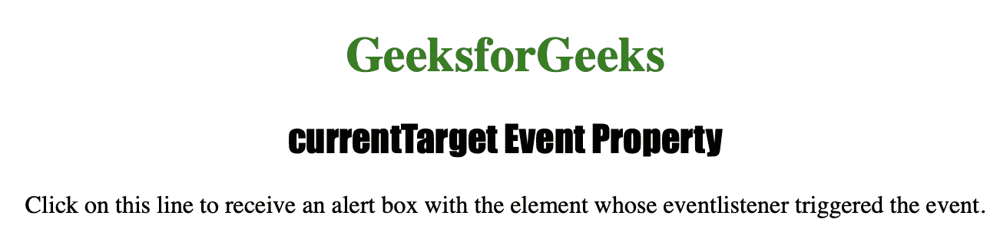
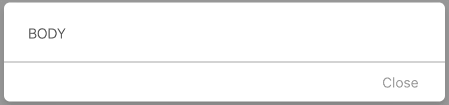

# HTML |当前目标事件属性

> 原文:[https://www . geesforgeks . org/html-currenttarget-event-property/](https://www.geeksforgeeks.org/html-currenttarget-event-property/)

**currentTarget 事件**属性用于返回其事件侦听器负责触发事件的元素。**当前目标事件**属性通常在捕获和冒泡期间使用。

**语法:**

```html
event.currentTarget
```

下面的程序说明了**电流目标事件**属性:

**示例:**获取其事件侦听器触发特定事件的元素。

```html
<!DOCTYPE html>
<html>

<head>
    <title>currentTarget Event Property in HTML</title>
    <style>
        h1 {
            color: green;
        }

        h2 {
            font-family: Impact;
        }

        body {
            text-align: center;
        }
    </style>
</head>

<body onclick="MyEvent(event)">

    <h1>GeeksforGeeks</h1>
    <h2>currentTarget Event Property</h2>

    <p>Click on this line to receive an 
      alert box with the element whose 
      event listener triggered the event.</p>

    <script>
        function MyEvent(event) {
            alert(event.currentTarget.nodeName);
        }
    </script>

</body>

</html>       
```

**输出:**

**点击按钮前:**


**点击按钮后:**


**支持的浏览器:**

*   歌剧
*   微软公司出品的 web 浏览器
*   谷歌 Chrome
*   火狐浏览器
*   苹果 Safari