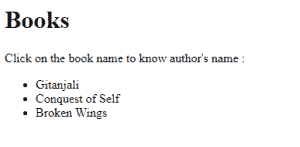
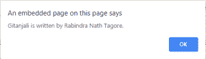

# HTML |数据-*属性

> 原文:[https://www.geeksforgeeks.org/html-data-attributes/](https://www.geeksforgeeks.org/html-data-attributes/)

自定义数据属性允许您将自己的信息添加到 HTML 标签中。即使名称另有所指，这些并不是 HTML5 特有的，您可以在所有 HTML 元素上使用 data-*属性。
数据-* 属性可以用来定义我们自己的自定义数据属性。它用于存储页面或应用程序私有的自定义数据。
数据属性主要有 2 部分:

1.  **属性名称:**必须至少有一个字符长，不包含大写字母，并以“data-”为前缀。
2.  **属性值:**可以是任意字符串。

**语法:**

```html
<li data-book-author="Rabindra Nath Tagore"> Gitanjali </li>
```

**例:**

## 超文本标记语言

```html
<!DOCTYPE html>
<html>
<head>
    <script>
        function showDetails(book) {
            var bookauthor = book.getAttribute("data-book-author");
            alert(book.innerHTML + " is written by "
                                    + bookauthor + ".");
        }
    </script>
</head>

<body>
    <h1>Books</h1>

<p>Click on the book name to know author's name :</p>

    <ul>
        <li onclick="showDetails(this)" id="gitanjali"
                data-book-author="Rabindra Nath Tagore">
            Gitanjali
        </li>

        <li onclick="showDetails(this)" id="conquest_of_self"
                data-book-author="Mahatma Gandhi">
            Conquest of Self
        </li>

        <li onclick="showDetails(this)" id="broken_wings"
                data-book-author="Sarojini Naidu">
            Broken Wings
        </li>
    </ul>
</body>
</html>                   
```

**输出:**



当我们点击这本书时，我们可以在一个单独的对话框中看到作者的名字。



**支持的浏览器:**HTML |数据-*属性支持的浏览器

如下所示:

*   谷歌 Chrome
*   微软公司出品的 web 浏览器
*   火狐浏览器
*   旅行队
*   歌剧