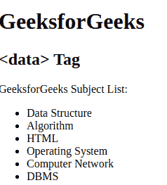

# HTML data 标签

> 原文:[https://www.geeksforgeeks.org/html-data-tag/](https://www.geeksforgeeks.org/html-data-tag/)

<data>元素通过机器可读的翻译器给出给定内容的地址。这个元素为处理器提供了一个机器可读的值，并在浏览器中提供了一个人类可读的值。</data> 

**语法:**

```html
<data value=""> Contents... </data>
```

**属性:**这个标签接受一个单一的属性，如上所述，如下所述。

*   [**值:**](https://www.geeksforgeeks.org/html-value-attribute/) 它包含单个机器可读翻译的内容。

**注意:**如果内容是日期或时间相关的内容，则使用<时间>元素代替数据元素。
T3】例:

## 超文本标记语言

```html
<!DOCTYPE html>
<html>
    <body>
        <h1>GeeksforGeeks</h1>
        <h2><data> Tag</h2>

<p>GeeksforGeeks Subject List:</p>

        <ul>
          <!-- data Tag starts here -->
             <li><data value="009">Data Structure</data></li>
             <li><data value="010">Algorithm</data></li>
             <li><data value="011">HTML</data></li>
             <li><data value="019">Operating System</data></li>
             <li><data value="110">Computer Network</data></li>
             <li><data value="111">DBMS</data></li>
          <!-- data Tag ends here -->
        </ul>
    </body>
</html>
```

**输出:**



**支持的浏览器:**

*   谷歌 Chrome 62.0
*   微软公司出品的 web 浏览器
*   Apple Safari 10 及以上版本
*   Firefox 22.0
*   Opera 49.0