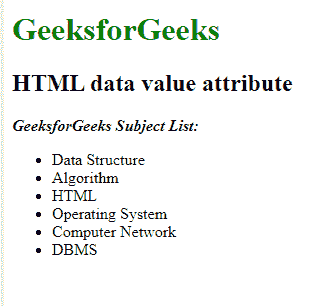

# HTML |数据值属性

> 原文:[https://www.geeksforgeeks.org/html-data-value-attribute/](https://www.geeksforgeeks.org/html-data-value-attribute/)

**HTML 数据值属性**用于指定元素内容的机器可读翻译。
**语法:**

```html
<data attribute> Contents... </data> 
```

**示例:**

## 超文本标记语言

```html
<!DOCTYPE html>
<html>

<head>
    <title>data tag</title>
</head>

<body>
    <h1 style="color:green;">GeeksforGeeks</h1>
    <h2> HTML data value attribute </h2>

<p><b><i>GeeksforGeeks Subject List:</i></b></p>

    <ul>
        <li>
            <data value="009">
              Data Structure
          </data>
        </li>
        <li>
            <data value="010">
              Algorithm
          </data>
        </li>
        <li>
            <data value="011">
              HTML
          </data>
        </li>
        <li>
            <data value="019">
              Operating System
          </data>
        </li>
        <li>
            <data value="110">
              Computer Network
          </data>
        </li>
        <li>
            <data value="111">
              DBMS
          </data>
        </li>
    </ul>
</body>

</html>
```

**输出:**



**支持的浏览器:****数据值属性**支持的浏览器如下:

*   谷歌 Chrome
*   微软公司出品的 web 浏览器
*   火狐浏览器
*   歌剧