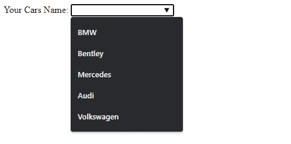
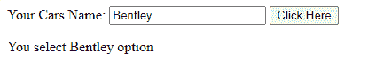

# HTML datalist 标签

> 原文:[https://www.geeksforgeeks.org/html-datalist-tag/](https://www.geeksforgeeks.org/html-datalist-tag/)

<datalist>标签用于在 HTML 文件中提供自动完成功能。它可以与输入标签一起使用，以便用户可以使用选择数据轻松地填写表单中的数据。
**语法:**</datalist>

```html
<datalist> ... </datalist>
```

**示例 1:** 下面的代码解释了数据列表标签。

## 超文本标记语言

```html
<!DOCTYPE html>
<html>
<body>
    <form action="">
        <label>Your Cars Name: </label>
        <input list="cars">

        <!--datalist Tag starts here -->
        <datalist id="cars">
            <option value="BMW"/>
            <option value="Bentley"/>
            <option value="Mercedes"/>
            <option value="Audi"/>
            <option value="Volkswagen"/>
        </datalist>
        <!--datalist Tag ends here -->

    </form>
</body>
</html>
```

**输出:**



**示例 2:**<数据列表>标签对象可以通过输入属性类型轻松访问。

## 超文本标记语言

```html
<!DOCTYPE html>
<html>
<body>
    <form action="">
        <label>Your Cars Name: </label>
        <input list="cars" id="carsInput" />

        <!--datalist Tag starts here -->
        <datalist id="cars">
            <option value="BMW" />
            <option value="Bentley" />
            <option value="Mercedes" />
            <option value="Audi" />
            <option value="Volkswagen" />
        </datalist>
        <!--datalist Tag ends here -->

        <button onclick="datalistcall()" type="button">
            Click Here
        </button>
    </form>
    <p id="output"></p>

    <!-- Will display the select option -->
    <script type="text/javascript">
        function datalistcall() {
            var o1 = document.getElementById("carsInput").value;
            document.getElementById("output").innerHTML =
              "You select " + o1 + " option";
        }
    </script>
</body>
</html>
```

**输出:**



**支持的浏览器:**

*   谷歌 Chrome 20.0 及以上版本
*   Internet Explorer 10.0 及以上版本
*   Firefox 4.0 及以上版本
*   Opera 9.0 及以上版本
*   Safari 11.1