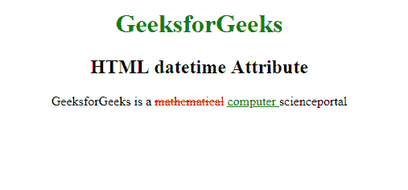

# HTML |日期时间属性

> 原文:[https://www.geeksforgeeks.org/html-datetime-attribute/](https://www.geeksforgeeks.org/html-datetime-attribute/)

**HTML 日期时间属性**用于*指定插入和删除文本的日期和时间*。它也代表了 [**<时间>**](https://www.geeksforgeeks.org/html-time-tag/) 元素的日期和时间。
**语法:**

```html
<element datetime="YYYY-MM-DDThh:mm:ssTZD"> 
```

**属性值:**该属性包含单值 YYYY-MM-DDThh:mm:ssTZD，用于指定删除文本的日期和时间。

日期时间组件的解释如下:

*   YYYY:设置日期时间对象的年份(如 2009 年)。
*   MM:它设置日期时间对象的月份(例如 05 代表三月)。
*   DD:它设置日期时间对象的月份(例如 04)。
*   这是必需的分隔符。
*   hh:它设置日期时间对象的小时(例如 06.00pm 的 18)。
*   mm:它设置 datetime 对象的分钟数(例如 34)。
*   ss:它设置日期的秒数
*   时间对象(例如 40)。

ZD:时区指示器(Z 表示祖鲁语，也称为格林威治标准时间)

**适用:**日期时间属性适用于:

*   [**HTML | <来自>标签**](https://www.geeksforgeeks.org/html-del-tag/)
*   [**HTML | < ins >标签**T3】](https://www.geeksforgeeks.org/html-ins-tag/)
*   [**HTML | <时间>标签**T3】](https://www.geeksforgeeks.org/html-time-tag/)

**示例:**本示例说明了 datetime 属性的使用。

## 超文本标记语言

```html
<!DOCTYPE html>
<html>

<head>
    <title>
        HTML datetime Attribute
    </title>

    <style>
        del {
            color: red;
        }

        ins {
            color: green;
        }

        h1 {
            color: green;
        }

        body {
            text-align: center;
        }
    </style>
</head>

<body>
    <h1>GeeksforGeeks</h1>

    <h2>
        HTML datetime Attribute
    </h2>

<p>GeeksforGeeks is a
        <del>mathematical</del>

        <!-- Assigning id to
            'ins' tag -->
        <ins id="GFG" datetime="2018-11-21T15:55:03Z">
            computer
        </ins>

        <time datetime="2017-02-14 20:00">
            scienceportal
        </time>

    </p>

</body>

</html>
```

**输出:**



**支持的浏览器:***日期时间属性*支持的浏览器如下:

*   谷歌 Chrome
*   微软公司出品的 web 浏览器
*   火狐浏览器
*   歌剧
*   旅行队