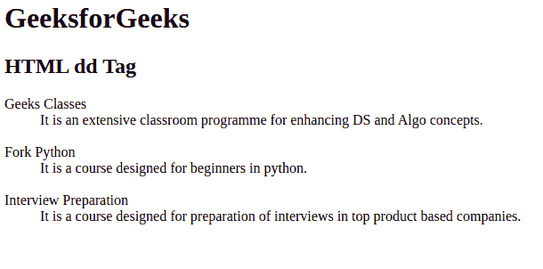
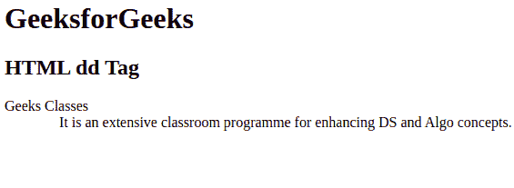

# HTML dd 标签

> 原文:[https://www.geeksforgeeks.org/html-dd-tag/](https://www.geeksforgeeks.org/html-dd-tag/)

HTML 中的

标记代表定义描述，用于表示描述列表中某项的描述或定义。段落、换行符、图像、链接、列表可以插入到

标签中。HTML 中的

标签与定义描述列表的[<【dl】>](https://www.geeksforgeeks.org/html-dl-tag/)标签以及定义描述列表中术语的 [< dt >](https://www.geeksforgeeks.org/html-dt-tag/) 标签一起使用。< dd >标签需要一个起始标签，但是结束标签是可选的。

**语法:**

```html
<dd> Contents... </dd>
```

**示例 1:** 下面的程序用 HTML 说明了< dd >元素。

## 超文本标记语言

```html
<!DOCTYPE html>
<html>   
    <body>
        <h1>GeeksforGeeks</h1>
        <h2>HTML dd Tag</h2>
        <dl>
            <dt>Geeks Classes</dt>
            <dd>It is an extensive classroom programme 
            for enhancing DS and Algo concepts.</dd>
            <br>
            <dt>Fork Python</dt>
            <dd>It is a course designed for beginners 
            in python.</dd>
            <br>
            <dt>Interview Preparation</dt>
            <dd>It is a course designed for preparation
            of interviews in top product based companies.</dd>
       </dl>  
    </body>
</html>                    
```

**输出:**



**示例 2:** 本示例使用具有显示属性的< dd >标签。

## 超文本标记语言

```html
<!DOCTYPE html>
<html>
    <body>
        <h1>GeeksforGeeks</h1>
        <h2>HTML dd Tag</h2>
        <dl>
            <dt>Geeks Classes</dt>
            <dd style="display: inline; margin-left: 60px">
               It is an extensive classroom programme 
               for enhancing DS and Algo concepts.
            </dd>
        </dl>
    </body>
</html>                    
```

**输出:**



**支持的浏览器:**

*   谷歌 Chrome
*   微软公司出品的 web 浏览器
*   火狐浏览器
*   歌剧
*   旅行队