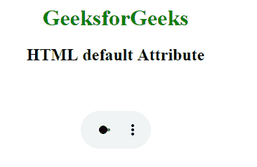

# HTML |默认属性

> 原文:[https://www.geeksforgeeks.org/html-default-attribute/](https://www.geeksforgeeks.org/html-default-attribute/)

**HTML 默认属性**是一个布尔属性。此属性用于指定如果用户的首选项不表明另一个轨道更合适，则将启用该轨道。
**注意:**使用默认属性，每个媒体元素不能有多个轨道元素。
**语法:**

```html
<track src="subtitles_en.vtt" default>
```

**适用:**

*   [<赛道>](https://www.geeksforgeeks.org/html-track-default-attribute/?ref=rp)

**例:**

## 超文本标记语言

```html
<html>

<head>
    <style>
        body {
            text-align: center;
        }

        h1 {
            color: green;
        }
    </style>
</head>

<body>
    <h1>GeeksforGeeks</h1>
    <h2>
    HTML default Attribute
</h2>

    <video width="100"
           height="100"
           controls>

        <track src=
"https://write.geeksforgeeks.org/wp-content/uploads/11.mp4"
               kind="subtitles"
               srclang="en"
               label="English"
               default>

            <source id="myTrack"
                    src=
"https://write.geeksforgeeks.org/wp-content/uploads/11.mp4"
                    type="video/mp4">

    </video>
</body>

</html>
```

**输出:**



**支持的浏览器:****HTML 默认属性**支持的浏览器如下:

*   谷歌 Chrome 18.0
*   Internet Explorer 10.0
*   Firefox 31.0
*   苹果 Safari 6.0
*   Opera 15.0