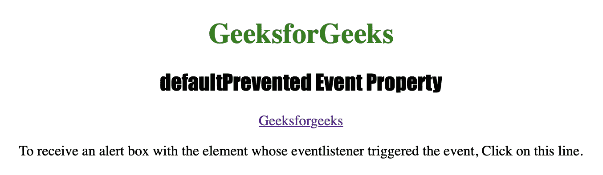
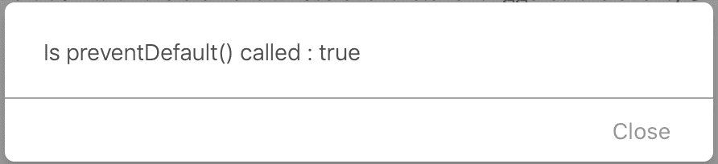

# HTML |默认阻止事件属性

> 原文:[https://www . geeksforgeeks . org/html-default prevented-event-property/](https://www.geeksforgeeks.org/html-defaultprevented-event-property/)

**defaultPrevented 事件**属性用于检查是否为该事件调用了 **preventDefault()** 方法。

**返回值:**
**默认阻止事件**属性返回 *true* 如果为事件调用了 **preventDefault()** 方法，则返回 *false* 。

**语法:**

```html
event.defaultPrevented
```

下面的程序说明了默认阻止事件属性:

**示例-1:** 检查是否调用了 **preventDefault()** 。

```html
<!DOCTYPE html>
<html>

<head>
    <title>defaultPrevented Event Property in HTML</title>
    <style>
        h1 {
            color: green;
        }

        h2 {
            font-family: Impact;
        }

        body {
            text-align: center;
        }
    </style>
</head>

<body onclick="MyEvent(event)">

    <h1>GeeksforGeeks</h1>
    <h2>defaultPrevented Event Property</h2>

    <a id="mylink" href="https://www.geeksforgeeks.org">
    Geeksforgeeks
    </a>

    <p>To receive an alert box with the element
    whose eventlistener triggered the event, 
    Click on this line.
    </p>

    <script>
        document.getElementById("mylink").addEventListener(
            "click", function(event) {

                event.preventDefault()
                alert("Is preventDefault() called : " + 
                    event.defaultPrevented);
            });
    </script>

</body>

</html>                    
```

**输出:**
**点击按钮前:**


**点击按钮后:**


**支持的浏览器:**

*   歌剧
*   微软公司出品的 web 浏览器
*   谷歌 Chrome
*   火狐浏览器
*   苹果 Safari