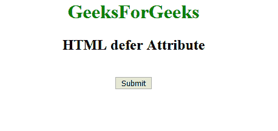
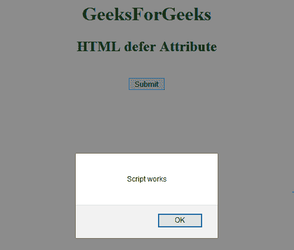

# HTML |延期属性

> 原文:[https://www.geeksforgeeks.org/html-defer-attribute/](https://www.geeksforgeeks.org/html-defer-attribute/)

HTML 延迟属性是一个布尔属性，用于指定当页面完成解析时执行脚本。此属性仅适用于外部脚本。

**适用:**

```html
<script>
```

**示例:**

```html
<!DOCTYPE html>
<html>

<head>
    <title>
        HTML defer Attribute
    </title>
</head>

<body style="text-align:center;">
    <h1 style="color:green"> 
        GeeksForGeeks 
    </h1>

    <h2> 
        HTML defer Attribute
    </h2>

    <script id="myGeeks"
            type="text/javascript"
            src="my_script.js"
            defer>
    </script>
    <br>
    <button type="button"
            onclick="myFunction()">
      Submit
  </button>

</body>

</html>
```

**外部脚本:** *my_script.js*

```html
function myFunction() {
    alert("Script works");
}
```

**输出:**
**点击前:**

**点击后:**


**支持的浏览器:****HTML 延期属性**支持的浏览器如下:

*   谷歌 Chrome
*   微软公司出品的 web 浏览器
*   火狐浏览器
*   苹果 Safari
*   歌剧