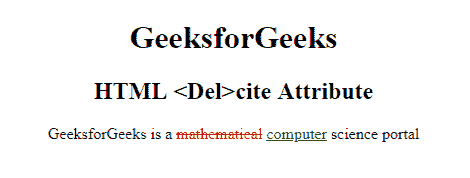

# HTML | del 引用属性

> 原文:[https://www.geeksforgeeks.org/html-del-cite-attribute/](https://www.geeksforgeeks.org/html-del-cite-attribute/)

**HTML < del >引用属性**用于指定*文档或消息的网址，该网址表示删除文本*的原因。

**语法:**

```html
<del cite="URL"> 
```

**属性值:**

*   **URL:** 包含指定报价来源的值即 **URL** 。

**可能值:**

*   **绝对 URL:** 指向另一个网站。
*   **相对 URL:** 它指向网站内的一个文件。

**示例:**

```html
<!DOCTYPE html>
<html>

<head>
    <title>
        HTML <Del>cite Attribute
    </title>
    <style>
        del {
            color: red;
        }

        ins {
            color: green;
        }
    </style>
</head>

<body style="text-align:center;">
    <h1> 
    GeeksforGeeks 
</h1>

    <h2> 
     HTML <Del>cite Attribute
</h2>

    <p>
        GeeksforGeeks is a
        <del id="GFG" 
             cite="www.GeeksForGeeks.com"> 
            mathematical</del>
        <ins> 
        computer</ins> science portal
    </p>
</body>

</html>
```

**输出:**


**支持的浏览器:**支持的浏览器 **HTML < del >引用属性**如下:

*   谷歌 Chrome
*   微软公司出品的 web 浏览器
*   火狐浏览器
*   歌剧
*   旅行队