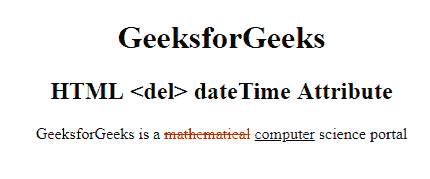

# HTML |日期时间属性

> 原文:[https://www.geeksforgeeks.org/html-del-datetime-attribute/](https://www.geeksforgeeks.org/html-del-datetime-attribute/)

HTML 中的 **< del > datetime 属性**用于指定被删除文本的日期和时间。日期时间以**格式插入。**
**语法:**

```html
<del datetime="YYYY-MM-DDThh:mm:ssTZD"> 
```

**属性值:**该属性包含单个值 **YYYY-MM-DDThh:mm:ssTZD** ，用于指定文本被删除的日期和时间。
日期时间成分解释如下:

*   **YYYY:** 设置日期时间对象的年份(如 2009)。
*   **MM:** 设置日期时间对象的月份(如 05 表示三月)。
*   **DD:** 设置日期时间对象的月份中的某一天(如 04)。
*   **T:** 是必需的分隔符。
*   **hh:** 设置 datetime 对象的小时(如 06.00pm 为 18)。
*   **mm:** 设置日期时间对象的分钟数(如 34)。
*   **ss:** 设置日期时间对象的秒数(如 40)。
*   **TZD:** 时区指示符(Z 表示祖鲁语，也称为格林威治标准时间)

**例:**

## 超文本标记语言

```html
<!DOCTYPE html>
<html>

<head>
    <title>
        HTML Del dateTime Attribute
    </title>

    <style>
        del {
            color: red;
        }

        ins {
            color: green;
        }
    </style>
</head>

<body style="text-align:center;">
    <h1>
    GeeksforGeeks
</h1>

    <h2>
    HTML <del> dateTime Attribute
</h2>

<p>
        GeeksforGeeks is a
        <del id="GFG" datetime="2018-11-21T15:55:03Z">
            mathematical
        </del>

        <ins>computer</ins> science portal
    </p>

</body>

</html>                   
```

**输出:**



**支持的浏览器:**T2 HTML<del>dateTime 属性支持的浏览器如下:

*   谷歌 Chrome
*   微软公司出品的 web 浏览器
*   火狐浏览器
*   歌剧
*   旅行队