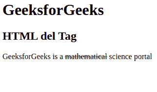

# HTML del 标签

> 哎哎哎:# t0]https://www . geeksforgeeks . org/html-del 标签/

HTML 中的~~标记代表删除，用于标记已经从文档中删除的部分文本。被删除的文本被网页浏览器渲染为删除文本，虽然这个属性可以使用 [CSS 文本修饰属性](https://www.geeksforgeeks.org/css-text-decoration-property/)来改变。< del >标签需要一个开始和结束标签。~~

**属性:**<del>标签包含以下列出的两个属性:

*   [**引用**](https://www.geeksforgeeks.org/html-cite-attribute/) **:** 用于指定表示删除文本原因的文档或消息的网址。
*   [**datetime**](https://www.geeksforgeeks.org/html-datetime-attribute/)**:**用于指定删除文本的日期和时间。

**语法:**

```html
<del> Contents... </del>
```

**示例 1:** 以下示例说明了 HTML 中的< del >元素:

## 超文本标记语言

```html
<!DOCTYPE html>
<html>
    <body>
        <h1>GeeksforGeeks</h1>
        <h2>HTML del Tag</h2>
        <!-- HTML del tag is used in paragraph Tag -->

<p>GeeksforGeeks is a <del>mathematical</del>
           science portal</p>

    </body>
</html>                   
```

**输出:**



**示例 2:** 本示例使用带有日期时间属性的< del >标记。

## 超文本标记语言

```html
<!DOCTYPE html>
<html>
    <body>
        <h1>GeeksforGeeks</h1>
        <h2>HTML del Tag</h2>
        <!-- HTML del tag is used in paragraph Tag -->

<p>GeeksforGeeks is a <del>mathematical</del>
           science portal</p>

    </body>
</html>                   
```

**输出:**


**支持的浏览器:**

*   谷歌 Chrome
*   微软公司出品的 web 浏览器
*   Firefox 1 及以上版本
*   歌剧
*   旅行队
*   边缘