# HTML |设计表单

> 原文:[https://www.geeksforgeeks.org/html-design-form/](https://www.geeksforgeeks.org/html-design-form/)

**什么是 HTML 表单:**
HTML 表单是使用交互控件在网络服务器上存储用户信息的文档。一个 HTML 表单包含不同种类的信息，如用户名、密码、联系号码、电子邮件 id 等。
HTML 表单中使用的元素有复选框、输入框、单选按钮、提交按钮等。使用这些元素，用户的信息被提交到网络服务器上。
表单**标签用于创建一个 HTML 表单。** 

### 一个超文本标记语言表单的例子:

## 超文本标记语言

```html
<!DOCTYPE html>
<html>
<body>

<form>
  Username:<br>
  <input type="text" name="username">
  <br>
  Email id:<br>
  <input type="text" name="email_id">
  <br><br>
  <input type="submit" value="Submit">
</form>

</body>
</html>
```

**输出:**

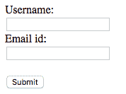

### HTML 表单中的输入元素:

输入元素是 HTML 表单中最常用的元素。可以创建各种用户输入字段，如文本字段、复选框、密码字段、单选按钮、提交按钮等。最常见的输入元素如下所示:

1.  **HTML 表单中的文本字段:**
    文本字段是一行输入字段，允许用户输入文本。文本字段输入控件是使用“输入”元素创建的，其类型属性的值为“文本”。

## 超文本标记语言

```html
<!DOCTYPE html>
<html>
<h3>Example Of Text Field</h3>
<body>
    <form>
        <label for="EMAIL ID">Email Id:</label><br>
        <input type="text" name="Email id" id="Email id">
    </form>
</body>
</html>
```

1.  **输出:**

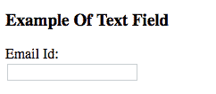

2.  **HTML 表单中的密码字段:**
    密码字段是一种文本字段，其中输入的文本使用星号或点进行屏蔽，以防止用户身份被屏幕上的其他人看到。密码字段输入控件是使用“输入”元素创建的，其类型属性的值为“密码”。

## 超文本标记语言

```html
<!DOCTYPE html>
<html>
<h3>Example of Password Field</h3>   
<body>
    <form>
        <label for="user-password">Password:
        </label><br>
        <input type="password" name="user-pwd"
                            id="user-password">
    </form>
</body>
</html>
```

1.  **输出:**

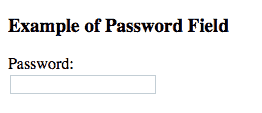

2.  **HTML 表单中的单选按钮:**
    单选按钮用于让用户从预定义选项列表中选择一个选项。单选按钮输入控件是使用“input”元素创建的，其类型属性的值为“Radio”。

## 超文本标记语言

```html
<!DOCTYPE html>
<html>
<h3>Example of Radio Buttons</h3>
<body>
    <form>
        SELECT GENDER
        <br>
        <input type="radio" name="gender" id="male">
        <label for="male">Male</label><br>
        <input type="radio" name="gender" id="female">
        <label for="female">Female</label>
    </form>
</body>
</html>
```

1.  **输出:**

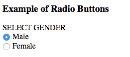

2.  **HTML 表单中的复选框:**
    复选框用于让用户从预定义的选项集中选择一个或多个选项。复选框输入控件是使用“input”元素创建的，其类型属性的值为“Checkbox”。

## 超文本标记语言

```html
<!DOCTYPE html>
<html>
<h3>Example of HTML Checkboxes</h3>
<body>
    <form>
        <b>SELECT SUBJECTS</b>
        <br>
        <input type="checkbox" name="subject" id="maths">
        <label for="maths">Maths</label>
        <input type="checkbox" name="subject" id="science">
        <label for="science">Science</label>
        <input type="checkbox" name="subject" id="english">
        <label for="english">English</label>
    </form>
</body>
</html>
```

1.  **输出:**

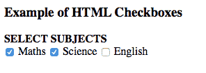

### HTML 表单中的文件选择框:

文件选择框用于允许用户选择本地文件并将其作为附件发送到 web 服务器。它类似于一个带有按钮的文本框，允许用户浏览文件。也可以写入文件的路径和名称，而不是浏览文件。文件选择框是使用“输入”元素创建的，其类型属性的值为“文件”。

## 超文本标记语言

```html
<!DOCTYPE html>
<html>
<h3>Example of a File Select Box</3>
    <body>
    <form>
        <label for="fileselect">Upload:</label>
        <input type="file" name="upload" id="fileselect">
    </form>
</body>
</html>
```

**输出:**

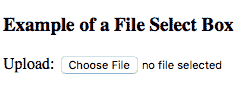

### HTML 表单中的文本区域:

文本区域是一个多行文本输入控件，允许用户提供多行描述或文本。使用“文本区域”元素创建文本区域输入控件。

## 超文本标记语言

```html
<!DOCTYPE html>
<html>
<h3>Example of a Text Area Box</h3>
<body>
    <form>
        <label for="Description">Description:</label>
        <textarea rows="5" cols="50" name="Description"
                            id="Description"></textarea>
    </form>
</body>
</html>
```

**输出:**

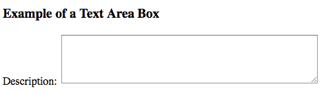

### 选择 HTML 表单中的框:

选择框用于允许用户从选项下拉列表中选择一个或多个选项。选择框使用“选择”和“选项”两个元素创建。列表项在 select 元素中定义。

## 超文本标记语言

```html
<!DOCTYPE html>
<html>
<h3>Example of a Select Box</h3>
<body>
    <form>
        <label for="country">Country:</label>
        <select name="country" id="country">
            <option value="India">India</option>
            <option value="Sri Lanka">Sri Lanka</option>
            <option value="Australia">Australia</option>
        </select>
    </form>
</body>
</html>
```

**输出:**

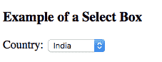

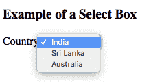

### 重置和提交按钮:

“提交”按钮允许用户将表单数据发送到网络服务器。重置按钮用于重置表单数据并使用默认值。

## 超文本标记语言

```html
<!DOCTYPE html>
<html>
<h3>Example of a Submit And Reset Button</h3>
<body>
    <form action="test.php" method="post" id="users">
        <label for="username">Username:</label>
        <input type="text" name="username" id="Username">
        <input type="submit" value="Submit">
        <input type="reset" value="Reset">
    </form>
</body>
</html>
```

**输出:**

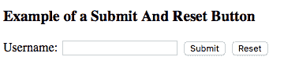

<u>HTML 表单中使用的属性</u>

**动作属性:**
表单提交后要执行的动作由动作属性决定。通常，在用户点击提交按钮后，表单数据被发送到 web 服务器上的网页。
**例:**

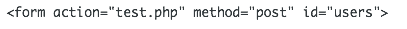

## 超文本标记语言

```html
<!DOCTYPE html>
<html>
<h3>Example of a Submit And Reset Button</h3>
<body>
    <form action="test.php" method="post" id="users">
        <label for="username">Username:</label>
        <input type="text" name="username" id="Username">
        <input type="submit" value="Submit">
        <input type="reset" value="Reset">
    </form>
</body>
</html>
```

```html
If you click the submit button, the form data
would be sent to a page called test.php .
```

**HTML 表单中的目标属性:**
目标属性用于指定提交的结果将在当前窗口、新选项卡还是新框架中打开。使用的默认值是“self”，这将导致表单在同一窗口中提交。为了使表单结果在新的浏览器选项卡中打开，该值应设置为“空白”。

## 超文本标记语言

```html
<!DOCTYPE html>
<html>
<body>

<form action="/test.php" target="_blank">
  Username:<br>
  <input type="text" name="username">
  <br>
  Password:<br>
  <input type="password" name="password">
  <br><br>
  <input type="submit" value="Submit">
</form>

</body>
</html>
```

```html
After clicking on the submit button, the result 
will open in a new browser tab.
```

**Html 表单中的名称属性:**
每个输入字段都需要名称属性。如果没有在输入字段中指定 name 属性，则根本不会发送该字段的数据。

## 超文本标记语言

```html
<!DOCTYPE html>
<html>
<body>

<form action="/test.php" target="_blank">
  Username:<br>
  <input type="text">
  <br>
  Password:<br>
  <input type="password" name="password">
  <br><br>
  <input type="submit" value="Submit">
</form>

</body>
</html>
```

```html
In the above code, after clicking the submit button, the form data will
be sent to a page called /test.php. The data sent would not include the
username input field data since the name attribute is omitted.
```

#### 方法属性:

它用于指定提交表单时用于发送数据的 HTTP 方法。HTTP 方法有两种，GET 和 POST。
**GET 方法–**

## 超文本标记语言

```html
<!DOCTYPE html>
<html>
<body>

<form action="/test.php" target="_blank" method="GET">
  Username:<br>
  <input type="text" name="username">
  <br>
  Password:<br>
  <input type="password" name="password">
  <br><br>
  <input type="submit" value="Submit">
</form>

</body>
</html>
```

```html
In the GET method, after the submission of the form, the form values 
will be visible in the address bar of the new browser tab.
```

**邮寄方法–**

## 超文本标记语言

```html
<!DOCTYPE html>
<html>
<body>

<form action="/test.php" target="_blank" method="post">
  Username:<br>
  <input type="text" name="username">
  <br>
  Password:<br>
  <input type="password" name="password">
  <br><br>
  <input type="submit" value="Submit">
</form>

</body>
</html>
```

```html
In the post method, after the submission of the form, the form values
will not be visible in the address bar of the new browser tab as it was
visible in the GET method.
```

**支持的浏览器:**

*   谷歌 Chrome
*   微软公司出品的 web 浏览器
*   火狐浏览器
*   歌剧
*   旅行队

HTML 是网页的基础，通过构建网站和网络应用程序用于网页开发。您可以通过以下 [HTML 教程](https://www.geeksforgeeks.org/html-tutorials/)和 [HTML 示例](https://www.geeksforgeeks.org/html-examples/)从头开始学习 HTML。