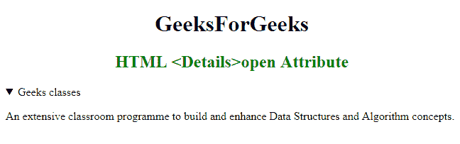

# HTML | details 打开属性

> 原文:[https://www.geeksforgeeks.org/html-details-open-attribute/](https://www.geeksforgeeks.org/html-details-open-attribute/)

**HTML <详细信息>开放属性**用于指示详细信息是否会在页面加载时显示。它是一个布尔属性。如果该属性存在，那么细节将是可见的。

**语法:**

```html
<details open> Contents... </details>
```

**示例:**本示例说明了<细节>元素中开放属性的使用。

```html
<!-- HTML program to illustrate details open Attribute -->

<!DOCTYPE html> 
<html> 
    <head> 
        <title>HTML details open Attribute</title> 
    </head> 

    <body> 
        <h1 style="text-align:center;">
            GeeksForGeeks
        </h1>

        <h2 style = "color: green; text-align: center;"> 
            HTML <Details>open Attribute 
        </h2> 

        <!-- Below details tag has "open" attribute -->
        <details open> 
            <summary>Geeks classes</summary> 

            <p> 
                An extensive classroom programme to build 
                and enhance Data Structures and Algorithm 
                concepts. 
            </p> 
        </details> 
    </body> 
</html>                    
```

**输出:**


**支持的浏览器:**HTML 支持的浏览器<详情>开放属性如下:

*   谷歌 Chrome 12.0
*   Firefox 49.0
*   Safari 6.0
*   Opera 15.0