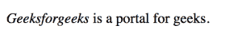
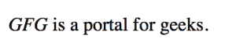
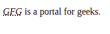
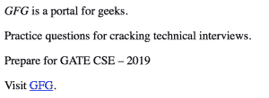

# HTML dfn 标签

> 哎哎哎:# t0]https://www . geeksforgeeks . org/html-dfn 标签/

HTML 中的<dfn>标记表示定义元素，用于表示 HTML 中的定义实例。通常，定义实例是术语在文档中的第一次使用。<dfn>标签需要一个开始标签和一个结束标签。</dfn></dfn> 

**语法:**

```html
<dfn>.....</dfn>
```

下面的例子说明了 HTML 中的<dfn>标签:</dfn>

**例 1:**

## 超文本标记语言

```html
<!DOCTYPE html>

<html>

    <body>

        <!--HTML dfn tag-->

<p><dfn>Geeksforgeeks</dfn> is a portal for geeks.</p>

    </body>

</html>                   
```

**输出:**



**示例 2:** 使用< dfn >标签的[标题属性](https://www.geeksforgeeks.org/html-title-attribute/)。

## 超文本标记语言

```html
<!DOCTYPE html>

<html>

    <body>

         <!--HTML dfn tag with title attribute-->

<p><dfn title="Geeksforgeeks">GFG</dfn>
            is a portal for geeks.</p>

    </body>

</html>                   
```

**输出:**



**示例 3:** 在< dfn >元素中使用 [<缩写>标记](https://www.geeksforgeeks.org/html-abbr-tag/)的[标题属性](https://www.geeksforgeeks.org/html-title-attribute/)。

## 超文本标记语言

```html
<!DOCTYPE html>

<html>

    <body>

         <!--HTML dfn tag with title attribute and abbr tag-->

<p><dfn><abbr title="Geeksforgeeks">GFG</abbr>
         </dfn> is a portal for geeks.</p>

    </body>

</html>                   
```

**输出:**



**示例 4:** 使用 [id 属性](https://www.geeksforgeeks.org/html-id-attributes/)以及< dfn >标签。

## 超文本标记语言

```html
<!DOCTYPE html>

<html>

    <body>

        <!--HTML dfn tag with id attribute-->

<p><dfn id="Geeksforgeeks">GFG</dfn> is a
            portal for geeks.</p>

<p>Practice questions for cracking
           technical interviews.</p>

<p>Prepare for GATE CSE – 2019</p>

<p>Visit <a href="#Geeksforgeeks">GFG</a>.</p>

    </body>

</html>                   
```

**输出:**



**支持的浏览器:**

*   谷歌 Chrome
*   微软公司出品的 web 浏览器
*   火狐浏览器
*   歌剧
*   旅行队