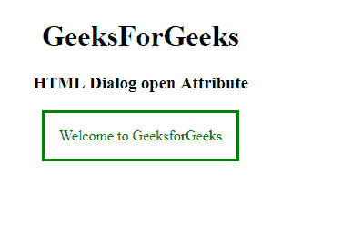

# HTML |对话框打开属性

> 原文:[https://www.geeksforgeeks.org/html-dialog-open-attribute/](https://www.geeksforgeeks.org/html-dialog-open-attribute/)

**HTML <对话框>打开属性**用于指定对话框是否打开。它在 HTML5 中是新的。它是一个布尔属性。
如果打开，表示用户可以与之交互。

**语法:**

```html
<dialog open>
```

**属性值:**它接受两个值，即*真|假* e，它指定是否应该打开对话框。默认情况下，它是假的。

*   **真:表示对话窗口打开。***   ****false:** It states that the dialog window is not open.

    **示例:**

    ```html
    <!DOCTYPE html>
    <html>

    <head>
        <style>
            body {
                text-align: center;
            }
        </style>
    </head>

    <body>
        <h1>
        GeeksForGeeks
    </h1>
        <h3>
         HTML Dialog open Attribute
         </h3>

        <dialog id="Dialog"
                style="color:green"
                open>
            Welcome to GeeksforGeeks
      </dialog>
    </body>

    </html>
    ```

    **输出:**
    

    **支持的浏览器:**打开属性的 **HTML <对话框>支持的浏览器如下:**

    *   谷歌 Chrome
    *   火狐浏览器
    *   苹果 Safari
    *   歌剧**