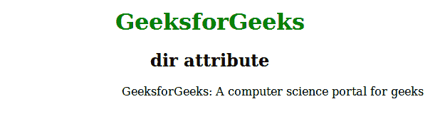
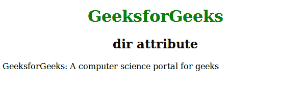

# HTML |目录属性

> 原文:[https://www.geeksforgeeks.org/html-dir-attribute/](https://www.geeksforgeeks.org/html-dir-attribute/)

该属性用于指定元素内容的文本方向。
**支持的标签:** Ir 支持所有 HTML 元素。

**语法:**

```html
<element dir = "ltr | rtl | auto">
```

**属性值:**该属性包含以下三个值:

*   **ltr:** 为默认值。该值代表从左到右文本方向的文本。
*   **rtl:** 该值代表从右向左文本方向的文本。
*   **自动:**让浏览器根据内容算出文字方向。

**例 1:**

## 超文本标记语言

```html
<!DOCTYPE html>
<html>
    <head>
        <title>dir attribute</title>
        <style>
            h1 {
                color:green;
            }
            h1, h2 {
                text-align:center;
            }
        </style>
    </head>
    <body>
        <h1>GeeksforGeeks</h1>
        <h2>dir attribute</h2>
        <p dir="rtl">GeeksforGeeks: A
        computer science portal for geeks</p>

    </body>
</html>
```

**输出:**



**例 2:**

## 超文本标记语言

```html
<!DOCTYPE html>
<html>
    <head>
        <title>dir attribute</title>
        <style>
            h1 {
                color:green;
            }
            h1, h2 {
                text-align:center;
            }
        </style>
    </head>
    <body>
        <h1>GeeksforGeeks</h1>
        <h2>dir attribute</h2>
        <p dir="ltr">GeeksforGeeks: A
        computer science portal for geeks</p>

    </body>
</html>
```

**输出:**



**支持的浏览器:**目录属性支持的浏览器如下:

*   铬
*   微软公司出品的 web 浏览器
*   火狐浏览器
*   歌剧
*   旅行队