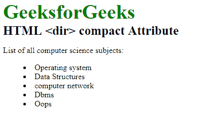

# HTML | dir 紧凑属性

> 原文:[https://www.geeksforgeeks.org/html-dir-compact-attribute/](https://www.geeksforgeeks.org/html-dir-compact-attribute/)

**HTML<dir>compact Attribute**用于通过减少列表项之间的空间和列表的缩进来定义列表应该小于正常值。它是一个布尔属性。
**语法:**

```html
<dir compact>
```

**注意:**HTML 5 不支持 HTML < dir >紧凑属性。

下面的例子说明了

<dir>紧凑属性的使用。
**例:**
</dir>

## 超文本标记语言

```html
<!DOCTYPE html>
<html>

<head>
    <title>
        HTML dir compact Attribute
    </title>

    <style>
        .gfg {
            font-size:40px;
            font-weight:bold;
            color:green;
        }
        .geeks {
            font-size:25px;
            font-weight:bold;
        }
    </style>
</head>

<body>
    <div class = "gfg">GeeksforGeeks</div>

    <div class = "geeks">
        HTML <dir> compact Attribute
    </div>

<p>List of all computer science subjects:</p>

    <dir compact>
        <li>Operating system</li>
        <li>Data Structures</li>
        <li>computer network</li>
        <li>Dbms</li>
        <li>Oops</li>
    </dir>
</body>

</html>
```

**输出:**



**支持的浏览器:**HTML<dir>紧凑属性不被任何浏览器支持。