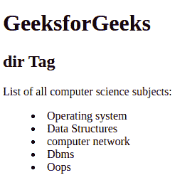
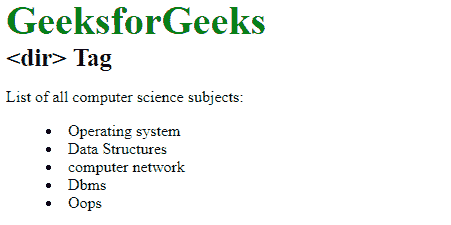

# HTML dir 标签

> 哎哎哎:# t0]https://www . geeksforgeeks . org/html-dir 标签/

它用于制作目录标题列表。HTML 5 不支持

<dir>标签。</dir>

**语法:**

```html
<dir> Lists... </dir>
```

以下示例说明了 HTML 中的

<dir>标记:
**示例:**</dir>

## 超文本标记语言

```html
<!DOCTYPE html>
<html>
    <body>

        <h1>GeeksforGeeks</h1>
        <h2><dir> Tag</h2>

<p>List of all computer science subjects:</p>

            <!-- dir tag starts here-->
            <dir>
                <li>Operating system</li>
                <li>Data Structures</li>
                <li>computer network</li>
                <li>Dbms</li>
                <li>Oops</li>
            </dir>
            <!-- dir tag ends here-->

    </body>
</html>                   
```

**输出:**



**可选属性:**该标签包含可选的单属性*契约*。它用于通过减少列表项之间的空间来指定列表大小呈现小于正常大小。它是一个布尔属性。
**例:**

## 超文本标记语言

```html
<!DOCTYPE html>
<html>
    <head>
        <title>dir tag</title>
        <style>
            .gfg {
                font-size:40px;
                font-weight:bold;
                color:green;
            }
            .geeks {
                font-size:25px;
                font-weight:bold;
            }
        </style>
    </head>
    <body>
        <div class = "gfg">GeeksforGeeks</div>
        <div class = "geeks"><dir> Tag</div>

<p>List of all computer science subjects:</p>

            <dir compact>
                <li>Operating system</li>
                <li>Data Structures</li>
                <li>computer network</li>
                <li>Dbms</li>
                <li>Oops</li>
            </dir>
    </body>
</html>                   
```

**输出:**



**注意:**任何浏览器都不支持紧凑属性。

**支持的浏览器:**

*   谷歌 Chrome
*   微软公司出品的 web 浏览器
*   火狐浏览器
*   歌剧
*   旅行队