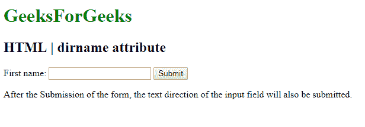
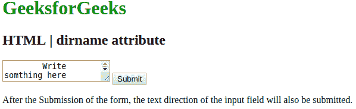

# HTML | dirname 属性

> 原文:[https://www.geeksforgeeks.org/html-dirname-attribute/](https://www.geeksforgeeks.org/html-dirname-attribute/)

**HTML | dirname 属性**用于*提交表单*后启用输入的文本方向和文本区域字段。dirname 属性的值必须是输入字段和文本区域的名称，后跟**。目录“**”。
可以和 **<一起使用，输入>** 和 **< textarea >** 元素。

*   **Dirname attribute in <input> Element:**
    **Syntax:**

    ```html
    <input name="myname" dirname="myname.dir">
    ```

    **示例-1:** 本示例说明了输入元素中 dirname 属性的使用。

    ```html
    <!DOCTYPE html>
    <html>

    <head>
        <style>
            h1 {
                color: green;
            }
        </style>
    </head>

    <body>

        <form action="/action_page.php">
            <h1>
              GeeksforGeeks
          </h1>
            <h2>
              HTML | dirname attribute
          </h2> First name:
            <input type="text" name="fname" dirname="fname.dir">

            <input type="submit" value="Submit">
        </form>

        <p>
          After the Submission of the form, 
          the text direction of the input 
          field will also be submitted.
        </p>

    </body>

    </html>
    ```

    **输出:**
    

*   **dirname attribute in <textarea> Element:**
    **Syntax:**

    ```html
    <textarea name="myname" dirname="myname.dir"></textarea>
    ```

    **示例-2:** 本示例说明了在 Textarea 元素中使用 dirname 属性。

    ```html
    <!DOCTYPE html>
    <html>

    <head>
        <style>
            h1 {
                color: green;
            }
        </style>
    </head>

    <body>

        <form action="/action_page.php">
            <h1>
              GeeksforGeeks
          </h1>
            <h2>HTML | dirname attribute
          </h2>
            <textarea name="Geeks" dirname="geeks.dir" 
                      placeholder="write something here">
            </textarea>
            <input type="submit" value="Submit">
        </form>

        <p>
            After the Submission of the form, the text 
            direction of the Textarea field will also, 
            be submitted.
        </p>
    </body>

    </html>
    ```

    **输出:**
    

**支持的浏览器:**支持的浏览器 *dirname* 属性如下:

*   谷歌 Chrome
*   歌剧
*   旅行队