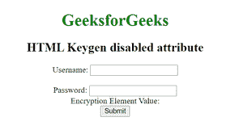

# HTML 禁用属性

> 原文:[https://www.geeksforgeeks.org/html-disabled-attribute-2/](https://www.geeksforgeeks.org/html-disabled-attribute-2/)

**HTML <键根>禁用属性**是一个布尔属性，表示 **<键根>** 元素是否禁用。它用于阻止用户使用输入字段，直到对其应用了某些条件。

**注意:**我们可以用 JavaScript 改变禁用的< keygen >元素的值。

**语法:**

```html
<keygen disabled>
```

**示例:**下面的代码说明了禁用的属性。

## 超文本标记语言

```html
<!DOCTYPE html>
<html>

<body>
    <center>
        <h1 style="color:green;">
            GeeksforGeeks
        </h1>

        <h2>HTML Keygen disabled attribute</h2>

        <form>
            Username: <input type="text" name="uname">
            <br><br>

            Password: <input type="text"><br>
            Encryption Element Value:
            <keygen form="myGeeks" name="secure" disabled>
            <br><input type="submit">
        </form>
    </center>
</body>

</html>
```

**输出:**



**支持的浏览器:**

*   谷歌 Chrome
*   火狐浏览器
*   歌剧
*   苹果 Safari