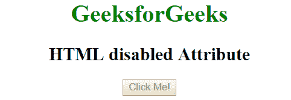

# HTML |禁用属性

> 原文:[https://www.geeksforgeeks.org/html-disabled-attribute/](https://www.geeksforgeeks.org/html-disabled-attribute/)

HTML 中的禁用属性指示元素是否被禁用。如果设置了此属性，元素将被禁用。禁用的属性通常以灰色文本绘制。如果元素被禁用，它不会对用户操作做出响应，也无法聚焦。它是一个布尔属性。

**用法**:可用于以下元素:<按钮>、<输入>、<选项>、<选择>、<文本区>、<功能设置>和<选项组>。
**语法:**

```html
<tag disabled></tag>

```

**<button>:**

*   **例:**

    ```html
    <!DOCTYPE html> 
    <html> 
        <head> 
            <title>HTML disabled Attribute</title> 
        </head> 
        <body style = "text-align:center">    
            <h1 style = "color: green;">GeeksforGeeks</h1>
            <h2>HTML disabled Attribute</h2>

            <!--A disabled button-->
            <button type="button" disabled>Click Me!</button>
        </body> 
    </html>    
    ```

    *   **Output:**
    

    **<输入> :** 当禁用属性存在时，指定输入被禁用。一个被禁用的页面不可用且不可点击。

    *   **例:**

    ```html
    <!DOCTYPE html> 
    <html> 
        <head> 
            <title>HTML disabled Attribute</title> 
        </head> 
        <body style = "text-align:center">    
            <h1 style = "color: green;">GeeksforGeeks</h1>
            <h2>HTML disabled Attribute</h2>

            <!--A disabled input-->
            <label>Input:
                <input type="text" name="value" value = 
                  "This input field is disabled" disabled>
            </label>
        </body> 
    </html>    

    ```

    *   **Output:**
    

    **<选项> :** 当禁用属性存在时，指定选项字段被禁用。禁用的选项不可用且不可点击。

    *   **例:**

    ```html
    <!DOCTYPE html> 
    <html> 
        <head> 
            <title>HTML disabled Attribute</title> 
        </head> 
        <body style = "text-align:center">    
            <h1 style = "color: green;">GeeksforGeeks</h1>
            <h2>HTML disabled Attribute</h2>

            <!--A disabled input-->
            <p>Volvo is disabled.</p>
            <select>
                 <option value="volvo" disabled>Volvo</option>
                 <option value="saab">Saab</option>
                 <option value="vw">VW</option>
                 <option value="audi">Audi</option>
            </select><br>

        </body> 
    </html>    
    ```

    *   **Output:**
    

    **<选择> :** 当禁用属性存在时，指定选择字段被禁用。禁用的选择不可用且不可点击。

    *   **例:**

    ```html
    <!DOCTYPE html> 
    <html> 
        <head> 
            <title>HTML disabled Attribute</title> 
        </head> 
        <body style = "text-align:center">    
            <h1 style = "color: green;">GeeksforGeeks</h1>
            <h2>HTML disabled Attribute</h2>

            <!--A disabled input-->
            <p>This select field is disabled.</p>
            <select disabled>
                 <option value="binary">Binary Search</option>
                 <option value="linear">Linear Search</option>
                 <option value="interpolation">
                  Interpolation Search
                 </option>
            </select>
        </body> 
    </html>    
    ```

    *   **Output:**
    

    **<文本区> :** 当禁用属性存在时，它指定文本区字段被禁用。禁用的文本区域不可用且不可点击。

    *   **例:**

    ```html
    <!DOCTYPE html> 
    <html> 
        <head> 
            <title>HTML disabled Attribute</title> 
        </head> 
        <body style = "text-align:center">    
            <h1 style = "color: green;">GeeksforGeeks</h1>
            <h2>HTML disabled Attribute</h2>

            <!--A disabled textarea-->
            <textarea disabled>
                This textarea field is disabled.
            </textarea>
        </body> 
    </html>    
    ```

    *   **Output:**
    

    **<字段集> :** 当禁用属性存在时，指定字段集被禁用。禁用的字段集不可用且不可点击。

    *   **例:**

    ```html
    <!DOCTYPE html> 
    <html> 
        <head> 
            <title>HTML disabled Attribute</title> 
        </head> 
        <body style = "text-align:center">    
            <h1 style = "color: green;">GeeksforGeeks</h1>
            <h2>HTML disabled Attribute</h2>

            <!--A disabled fieldset-->
            <p>This field set is disabled.</p>
            <fieldset disabled>
              Name: <input type="text"><br>
            </fieldset>
        </body> 
    </html>    
    ```

    *   **Output:**
    

    **< optgroup > :** 当禁用属性存在时，指定 optgroup 被禁用。禁用的 optgroup 不可用且不可点击。

    *   **例:**

    ```html
    <!DOCTYPE html> 
    <html> 
        <head> 
            <title>HTML disabled Attribute</title> 
        </head> 
        <body style = "text-align:center">    
            <h1 style = "color: green;">GeeksforGeeks</h1>
            <h2>HTML disabled Attribute</h2>

            <!--A disabled optgroup-->
            <select>
              <optgroup label="German Cars" disabled>
                <option value="mercedes">Mercedes</option>
                <option value="audi">Audi</option>
              </optgroup>
            </select>
        </body> 
    </html>    
    ```

    *   **Output:**
    

    **支持的浏览器:**禁用属性的*支持的浏览器如下:*

    *   谷歌 Chrome
    *   微软公司出品的 web 浏览器
    *   火狐浏览器
    *   歌剧
    *   旅行队